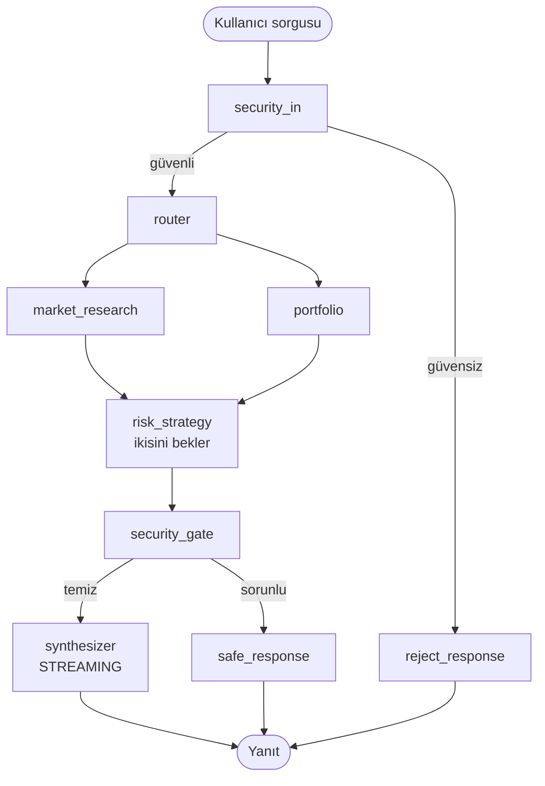
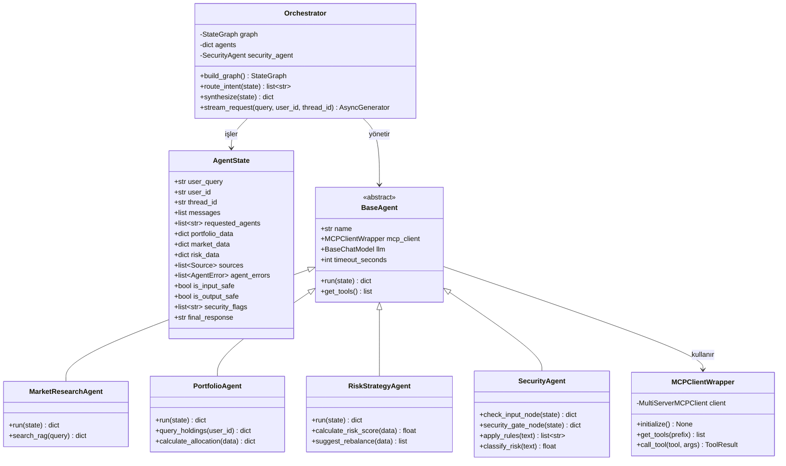
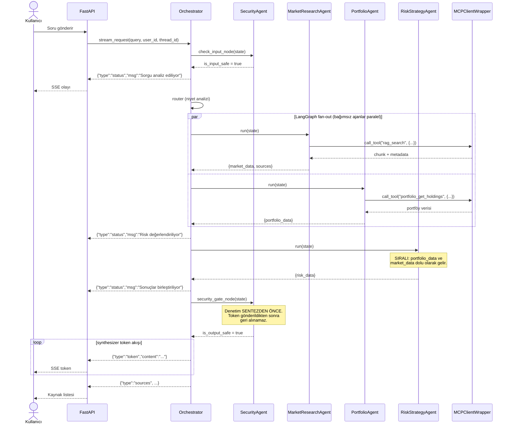

# SYSTEM_ARCHITECTURE.md
## Akıllı Kişisel Finans Danışmanı — Backend Mimarisi

**Sürüm:** v2.2 · **Durum:** Revize — streaming/güvenlik akışı, ajan bağımlılık topolojisi, piyasa verisi katmanı ve eksik state alanları eklendi.

---

## 0. Revizyon Notları (v1.0 → v2.2)

| # | Değişiklik | Gerekçe |
|---|---|---|
| 1 | Çıktı güvenlik kontrolü **synthesizer'dan önceye** alındı; streaming yalnızca onaylı içerik üzerinden yapılıyor | v1'de yanıt önce üretilip sonra denetleniyordu; token'lar gönderildikten sonra geri alınamayacağı için gerçek streaming imkânsızdı |
| 2 | `asyncio.gather` yerine **LangGraph fan-out/fan-in** kenarları | v1'de paralellik tek node içindeydi, LangGraph göremiyordu: node bazlı ilerleme olayı, checkpoint ve hata izolasyonu kayıptı |
| 3 | **Borsa API MCP Server kaldırıldı** | Canlı piyasa verisi kapsam dışı; tüm veri sentetik |
| 4 | Üç MCP sunucusu → **tek MCP sunucusu, tool grupları** | Tek container hedefiyle uyum; üç lifecycle/konfigürasyon yükü gereksiz |
| 5 | `handle_request() -> str` → **`AsyncGenerator`** | String dönen fonksiyon token akıtamaz |
| 6 | Router ile Security-In sırası düzeltildi: **güvenlik önce** | v1'de doküman kendi içinde çelişiyordu; kötü niyetli sorgu routing'e girmemeli |
| 7 | `SecurityAgent.run(state, mode)` → **iki ayrı node fonksiyonu** | LangGraph node'ları tek argüman alır; `mode` parametresi BaseAgent sözleşmesini bozuyordu |
| 8 | `AgentState`'e eklendi: `messages`, `thread_id`, `sources`, `agent_errors`, `requested_agents` | FR-CHAT-03 (çok turlu bağlam), FR-RAG-04 (izlenebilirlik), kısmi başarısızlık yönetimi |
| 9 | Ajan bazlı **model konfigürasyonu** eklendi | Ucuz model ajanlarda, güçlü model synthesizer'da; ücretsiz API kotası koruması |
| 10 | **Timeout ve graceful degradation** stratejisi eklendi | Bir ajan çökerse tüm istek düşmemeli |
| 11 | Güvenlik kontrolünde **kural motoru birincil**, LLM sınıflandırıcı ikincil | İstek başına LLM çağrısını 6'dan 4'e indirir; ücretsiz kota için kritik |
| 12 | WebSocket yerine **SSE** sabitlendi | Tek yönlü akış için daha basit; frontend scaffold'u SSE ile kurulu |
| 13 | **Risk ajanı paralel fan-out'tan çıkarıldı**, Piyasa ve Portföy ajanlarından sonra sıralı çalışacak şekilde konumlandırıldı | Risk ajanı portföy ve piyasa verisine ihtiyaç duyuyor; paralel çalıştığında bu alanlar henüz boş geliyordu (sessiz hata) |
| 14 | **Piyasa Verisi Katmanı** eklendi: `MarketDataProvider` arayüzü + simülatör ve API implementasyonları, periyodik güncelleme görevi, `market_*` MCP tool grubu | Canlı/güncellenen veri talebi; API kotası dakikalık güncellemeye yetmediği için hibrit tasarım (bkz. bölüm 2.5) |

---

## 1. Giriş ve Mimari Kararlar

### 1.1 Proje Amacı

Kullanıcının portföyünü analiz eden, piyasa dokümanlarını RAG ile yorumlayan, risk/strateji önerileri sunan ve tüm süreci güvenlik katmanıyla denetleyen çok ajanlı bir finansal karar destek asistanı.

### 1.2 Sabitlenen Teknoloji Kararları

| Alan | Karar |
|---|---|
| Dil / Runtime | Python 3.13 |
| Web framework | FastAPI + Uvicorn |
| Orkestrasyon | LangGraph (StateGraph) |
| RAG katmanı | LlamaIndex |
| Vector DB | **pgvector** (PostgreSQL üzerinde) |
| İlişkisel DB | PostgreSQL |
| Tool katmanı | MCP (tek sunucu, tool grupları) |
| LLM sağlayıcı | NVIDIA ücretsiz API (öğrenci erişimi) |
| Embedding modeli | *RAG grubu kararlaştıracak* — Türkçe retrieval performansı belirleyici |
| Sistem dili | Türkçe (arayüz, sorgular, dokümanlar, yanıtlar) |
| Piyasa verisi | **Hibrit:** simülatör (varsayılan) + opsiyonel ücretsiz API çapası — `MARKET_DATA_PROVIDER` ile seçilir |
| Portföy verisi | Sentetik (dummy data modülü) |
| Streaming | SSE (Server-Sent Events) |

### 1.3 Neden Modular Monolith?

Mikroservis yerine **tek process / tek container**:

| Kriter | Mikroservis | Modular Monolith (Seçilen) |
|---|---|---|
| Ajanlar arası iletişim | Ağ üzerinden (HTTP/gRPC) → gecikme | In-process çağrı → ~0ms overhead |
| Deployment karmaşıklığı | Yüksek (N adet servis) | Düşük (1 container) |
| MCP Client yönetimi | Her serviste ayrı client | Tek, paylaşılan client |
| Ekip için uygunluk | Büyük ekip gerektirir | Küçük/orta ekip için ideal |
| Hata ayıklama | Dağıtık trace gerekir | Tek log akışı |
| Ölçeklenme | Servis bazlı | Süreç içi modüler, ileride ayrıştırılabilir |

Sonuç: Düşük gecikme, düşük operasyonel yük, yüksek geliştirme hızı.

### 1.4 Katman Özeti

```
FastAPI (giriş noktası, SSE streaming)
   → Orchestrator (LangGraph StateGraph)
      → Güvenlik (girdi) → Router
         → Piyasa + Portföy ajanları (PARALEL)
            → Risk ajanı (SIRALI — ikisini bekler)
               → Güvenlik (çıktı, ham veri üzerinde) → Synthesizer (streaming)
                  → Ortak MCP Client (tek instance)
                     → MCP Sunucusu (tool grupları: portföy, RAG)
```

### 1.5 Güvenlik Ajanının Konumu — Kritik Tasarım Kararı

Güvenlik Ajanı akışta **iki noktada** çalışır:

**Girdi kontrolü (`security_in`):** Router'dan **önce**. Prompt injection, yetkisiz komut, kötü niyetli istek tespiti. Başarısızsa akış hiç ilerlemez, güvenli bir ret mesajı döner.

**Çıktı kontrolü (`security_gate`):** Synthesizer'dan **önce**, ajanların ürettiği ham veri üzerinde. Bu, v1'den en önemli farktır.

> **Neden çıktı kontrolü synthesizer'dan önce?**
> Streaming yapıldığında token'lar kullanıcıya gönderilmeye başlar. Yanıt tamamlandıktan sonra "bu güvensizdi" demek işe yaramaz — gönderilen token geri alınamaz. Bu yüzden denetim, **synthesizer LLM'i çalışmadan önce**, ajanlardan gelen ham veri üzerinde yapılır. Synthesizer ayrıca sistem prompt'unda uyum kurallarını (PII maskeleme, "yatırım tavsiyesi değildir" ibaresi) taşır. Böylece hem gerçek streaming korunur hem denetim boşa düşmez.

**Maliyet optimizasyonu:** Güvenlik kontrolünde önce kural motoru (`apply_rules` — regex/kelime listesi, LLM'siz, ~1ms) çalışır. Yalnızca kural motoru şüphe işareti verirse LLM tabanlı `classify_risk` devreye girer. Bu, istek başına LLM çağrısını 6'dan 4'e indirir; ücretsiz API kotası için belirleyicidir.

---

## 2. Mimari Şemalar

### 2.1 Bileşen Şeması

```
┌────────────────────────────────────────────────────────────────────┐
│                     TEK CONTAINER / TEK PROCESS                     │
│                                                                     │
│  ┌───────────────────────────────────────────────────────────────┐ │
│  │                   FastAPI (API Katmanı)                        │ │
│  │        POST /api/chat/stream (SSE)   |   GET /health           │ │
│  └────────────────────────────┬──────────────────────────────────┘ │
│                               ▼                                     │
│  ┌───────────────────────────────────────────────────────────────┐ │
│  │            ORCHESTRATOR (LangGraph StateGraph)                 │ │
│  │                                                                │ │
│  │  ① security_in    → girdi denetimi (kural + LLM)               │ │
│  │  ② router         → niyet analizi, ajan seçimi                 │ │
│  │  ③ fan-out        → BAĞIMSIZ ajanlar paralel                   │ │
│  │  ④ sıralı ajan    → bağımlı ajan, öncekileri bekler            │ │
│  │  ⑤ security_gate  → ham ajan verisi denetimi                   │ │
│  │  ⑥ synthesizer    → sentez + STREAMING çıktı                   │ │
│  └────────────────────────────┬──────────────────────────────────┘ │
│                               │                                     │
│         ┌─────────────────────┴─────────────────────┐               │
│         ▼                                           ▼               │
│  ┌───────────────────┐                   ┌───────────────────┐     │
│  │ MarketResearch    │                   │ PortfolioAgent    │     │
│  │ Agent (RAG)       │      PARALEL      │ (portföy)         │     │
│  └─────────┬─────────┘                   └─────────┬─────────┘     │
│            │                                       │               │
│            └───────────────────┬───────────────────┘               │
│                                ▼                                   │
│                   ┌───────────────────────┐                        │
│                   │ RiskStrategyAgent     │                        │
│                   │ (risk)     SIRALI     │                        │
│                   │ ikisinin verisini     │                        │
│                   │ bekler                │                        │
│                   └───────────┬───────────┘                        │
│                               ▼                                     │
│              ┌────────────────────────────────┐                    │
│              │  MCPClientWrapper (tek örnek)  │                    │
│              └────────────────┬───────────────┘                    │
│                               ▼                                     │
│              ┌────────────────────────────────┐                    │
│              │   MCP Server  (/mcp)           │                    │
│              │   ├─ portfolio_* tool grubu    │                    │
│              │   ├─ market_*    tool grubu    │                    │
│              │   └─ rag_*       tool grubu    │                    │
│              └────────────────┬───────────────┘                    │
│                               │                                     │
│  ┌────────────────────────────┼──────────────────────────────────┐ │
│  │  PİYASA VERİSİ KATMANI     │  (arka plan görevi, orchestrator  │ │
│  │                            │   akışından bağımsız)             │ │
│  │   MarketDataProvider ──────┤                                   │ │
│  │   ├─ SimulatedProvider (varsayılan, her N sn fiyat üretir)     │ │
│  │   └─ ApiProvider (opsiyonel, günde birkaç kez gerçek çapa)     │ │
│  └────────────────────────────┼──────────────────────────────────┘ │
└───────────────────────────────┼────────────────────────────────────┘
                                ▼
               ┌─────────────────────────────────┐
               │  PostgreSQL + pgvector          │
               │  (portföy + fiyatlar + embedding)│
               └─────────────────────────────────┘
```

> **Not 1 — ajan topolojisi:** MarketResearch ve Portfolio ajanları birbirinden bağımsız olduğu için paralel çalışır. RiskStrategy ajanı `portfolio_data` ve `market_data`'ya ihtiyaç duyduğu için **sıralı** konumdadır; LangGraph, kendisine gelen tüm kenarlar tamamlanmadan bu node'u başlatmaz. Gerekçe ve kural için bkz. bölüm 2.3.
>
> **Not 2 — MCP erişimi:** Şemada MCP Client ok akışının altında görünse de, **üç ajan da** aynı tek MCP Client örneğini kullanır; şema akış sırasını gösterir, erişim hiyerarşisini değil.
>
> **Not 3 — SecurityAgent:** Ajan fan-out'unun parçası olmadığı için ayrı kutu olarak gösterilmemiştir; graph'ta `security_in` ve `security_gate` adlı iki ayrı node olarak yer alır. MCP Client'a ihtiyaç duyarsa (kural tablosu sorgusu) aynı ortak client'ı kullanır.

### 2.2 Graph Akışı



### 2.3 Paralel mi, Sıralı mı? — Ajan Bağımlılık Kuralı

LangGraph'ta **sıralı çalışma varsayılandır**, paralellik istisnadır. State graph boyunca paylaşıldığı için sonraki node, önceki node'ların yazdığı her alanı doğrudan okur; ekstra bir mekanizma gerekmez.

**Kural:** Bir ajan başka bir ajanın çıktısına ihtiyaç duyuyorsa **sıralı**, duymuyorsa **paralel** konumlanır.

Bu projedeki bağımlılıklar:

| Ajan | Bağımlılığı | Konum |
|---|---|---|
| MarketResearchAgent | Yok (yalnızca kullanıcı sorgusu + RAG) | Paralel |
| PortfolioAgent | Yok (yalnızca `user_id` + MCP) | Paralel |
| RiskStrategyAgent | `portfolio_data` **ve** `market_data` | **Sıralı** — ikisinden sonra |
| Synthesizer | Hepsi | Sıralı — en sonda |

> **Neden bu düzeltme yapıldı:** v1'de üç ajan da paralel fan-out'taydı. Ancak Risk ajanı portföy ve piyasa verisine göre skor üretiyor; paralel çalıştığında bu alanlar henüz `None` olduğu için ajan boş veriyle çalışıyordu. Bu, hata fırlatmayan ama yanlış sonuç üreten türden sessiz bir hatadır — bu yüzden özellikle dikkat edilmelidir.

**Reducer üzerindeki etkisi:** Sıralı node'lar aynı anda yazmadığı için çakışma riski taşımaz. Reducer yalnızca gerçekten paralel yazılan alanlarda (`sources`, `agent_errors`, `security_flags`) gereklidir.

**Gecikme bedeli:** Paralel tasarımda toplam süre "en yavaş ajan + synthesizer" iken, şimdi "paralel faz + risk + synthesizer" olur; yani zincire bir LLM çağrısı daha eklenir. NFR-01'deki ilk token hedefi açısından hafifletme yolları: Risk ajanına küçük/hızlı model atamak (`RISK_MODEL`) ve paralel faz sırasında kullanıcıya ilerleme mesajı akıtmak ("Portföy analiz ediliyor...").

**İleride ajan eklenirse:** Aynı kural uygulanır. Örneğin bir Rapor Ajanı (FR-RISK-04, "Detaylı Rapor Oluştur") tüm ajanların çıktısını kullanacağı için en sonda, sıralı konumlanır; router'da ayrı bir dal olarak yönlendirilmesi tercih edilir, böylece normal sohbet kısa yoldan ilerler.

### 2.4 Piyasa Verisi Katmanı — Simülatör + Opsiyonel API

Dashboard'daki grafiklerin hareket etmesi, portföy değerinin ve risk skorunun zamanla değişmesi için piyasa verisinin **periyodik olarak güncellenmesi** gerekir. Bu, ajanların veya orchestrator'ın işi değildir; arka planda çalışan ayrı bir katmandır.

#### Neden hibrit tasarım?

Ücretsiz piyasa verisi API'ları iki kısıtla gelir:

| Kısıt | Etkisi |
|---|---|
| **Gecikme:** BIST verisi ücretsiz kaynaklarda 15 dakika gecikmeli | Zaten "anlık" değil |
| **Kota:** Ücretsiz katmanlar tipik olarak ayda ~500 çağrı, bazıları günde ~25 | Dakikada bir güncelleme = ayda ~43.000 çağrı → **kotanın ~80 katı** |

Yani API tek başına "canlı" hissi veremez. Çözüm, ikisini birleştirmek:

- **API çapa atar:** Günde 2–3 kez gerçek fiyat çekilir (kota içinde kalır), varlıkların baz fiyatı güncellenir.
- **Simülatör arayı doldurur:** Her N saniyede bir baz fiyat üzerinde küçük rastgele yürüyüş uygulanır, DB'ye yazılır.

Sonuç: fiyatlar gerçek değerlere yakın seyreder **ve** dashboard sürekli hareket eder. API çökerse veya kota biterse sistem simülatörle çalışmaya devam eder — demo günü risk sıfırlanır.

#### Sağlayıcı arayüzü

```python
# app/market/provider.py
from abc import ABC, abstractmethod


class MarketDataProvider(ABC):
    """Fiyat kaynağı soyutlaması. Ajanlar ve MCP tool'ları hangi
    implementasyonun çalıştığını BİLMEZ."""

    @abstractmethod
    async def fetch_prices(self, symbols: list[str]) -> dict[str, float]:
        ...


class SimulatedMarketProvider(MarketDataProvider):
    """
    Varsayılan sağlayıcı. Son fiyat üzerine varlık sınıfına göre
    ayarlanmış oynaklıkla rastgele yürüyüş uygular.

    Demo tekrarlanabilirliği için SABİT SEED kullanılır: prova edilen
    senaryo sunumda birebir aynı çıkar.
    """
    async def fetch_prices(self, symbols: list[str]) -> dict[str, float]:
        ...


class ApiMarketProvider(MarketDataProvider):
    """
    Ücretsiz API sağlayıcısı. Kota koruması zorunludur:
      - günlük çağrı sayacı (kota aşılırsa simülatöre düşer)
      - hata/timeout durumunda simülatöre düşer
      - çekilen fiyatlar baz fiyat olarak DB'ye yazılır
    """
    async def fetch_prices(self, symbols: list[str]) -> dict[str, float]:
        ...
```

#### Periyodik güncelleme görevi

```python
# app/market/scheduler.py
async def price_tick(provider: MarketDataProvider) -> None:
    """FastAPI lifespan içinde başlatılan arka plan görevi.
    Her tick'te fiyatları günceller ve DB'ye yazar."""
    while True:
        await update_prices(provider)
        await asyncio.sleep(settings.price_tick_seconds)


async def api_anchor() -> None:
    """Günde birkaç kez gerçek fiyat çekip baz fiyatı günceller.
    MARKET_DATA_PROVIDER=hybrid ise çalışır."""
    ...
```

> **Önemli:** Bu görev orchestrator'dan tamamen bağımsızdır. Ajanlar fiyat üretmez; yalnızca DB'de hazır duran güncel fiyatı MCP tool'u üzerinden okur.

#### MCP tool grubu

```python
# app/mcp/server.py — market_* tool grubu
@mcp.tool
async def market_get_quote(symbol: str) -> dict:
    """Bir varlığın güncel fiyatını döner (DB'den, kaynak fark etmez)."""
    ...

@mcp.tool
async def market_get_history(symbol: str, days: int = 30) -> dict:
    """Fiyat zaman serisini döner — grafikler ve risk hesabı için."""
    ...
```

#### Konfigürasyon

```
MARKET_DATA_PROVIDER=simulated     # simulated | api | hybrid
PRICE_TICK_SECONDS=60              # simülatör güncelleme aralığı
MARKET_API_KEY=
MARKET_API_DAILY_LIMIT=20          # kota koruması
MARKET_SIM_SEED=42                 # demo tekrarlanabilirliği
```

#### Karar tablosu

| Senaryo | Ayar | Gerekçe |
|---|---|---|
| Geliştirme / test | `simulated` | Kota yok, deterministik, çevrimdışı çalışır |
| Demo / sunum | `simulated` | Senaryo kontrol edilebilir; API kesintisi riski yok |
| "Gerçek veri de var" göstermek | `hybrid` | Kota içinde gerçek çapa + akıcı hareket |
| Canlı ortam | — | Kapsam dışı; gerçek para/emir işlemi yok |

> **Not:** Gerçek API kullanımı için PO onayı gerekir. Lisanslama ve veri kullanım şartları BIST tarafında ücretsiz kaynaklarda net değildir; gereksinim dokümanındaki "canlı piyasa verisi kapsam dışı" maddesi bu tasarımla **opsiyonel** hale gelmiştir, ancak varsayılan davranış hâlâ sentetiktir.

### 2.5 Sınıf Diyagramı



---

## 3. Sınıf ve Fonksiyon Haritası

### 3.1 Schema Katmanı — `app/schema/`

```python
# app/schema/models.py
import operator
from typing import Annotated, Literal, Optional
from pydantic import BaseModel, Field
from langgraph.graph.message import add_messages


class Source(BaseModel):
    """RAG yanıtının dayandığı kaynak doküman — FR-RAG-04 izlenebilirlik."""
    doc_id: str
    baslik: str
    sirket: Optional[str] = None
    tarih: Optional[str] = None
    tip: Optional[str] = None          # haber | bilanco | analist_raporu
    score: Optional[float] = None


class AgentError(BaseModel):
    """Bir ajanın başarısızlığı — akışı durdurmaz, kısmi yanıt üretilir."""
    agent_name: str
    error_type: Literal["timeout", "tool_error", "llm_error", "unknown"]
    message: str


class AgentState(BaseModel):
    """
    Graph boyunca taşınan ortak durum.

    ÖNEMLİ — Reducer kuralı:
    Paralel çalışan node'lar AYNI alana yazarsa LangGraph çakışma hatası verir.
    Her ajan kendi alanına yazar (portfolio_data / market_data / risk_data),
    ancak birden fazla node'un yazdığı alanlar (sources, agent_errors,
    security_flags) Annotated[..., operator.add] ile reducer taşımak ZORUNDA.
    """
    # Girdi
    user_query: str
    user_id: str
    thread_id: str                                    # oturum kimliği (FR-CHAT-03)

    # Konuşma geçmişi — çok turlu bağlam
    messages: Annotated[list, add_messages] = Field(default_factory=list)

    # Routing
    requested_agents: list[str] = Field(default_factory=list)

    # Ajan çıktıları — her ajan KENDİ alanına yazar, çakışma yok
    portfolio_data: Optional[dict] = None
    market_data: Optional[dict] = None
    risk_data: Optional[dict] = None

    # Paralel yazılan alanlar — reducer ZORUNLU
    sources: Annotated[list[Source], operator.add] = Field(default_factory=list)
    agent_errors: Annotated[list[AgentError], operator.add] = Field(default_factory=list)
    security_flags: Annotated[list[str], operator.add] = Field(default_factory=list)

    # Güvenlik
    is_input_safe: bool = True
    is_output_safe: bool = True

    # Çıktı
    final_response: Optional[str] = None


class ToolResult(BaseModel):
    """MCP tool çağrısının sonucu."""
    tool_name: str
    output: dict
    latency_ms: float
    success: bool = True
    error: Optional[str] = None
```

### 3.2 Konfigürasyon — `app/config.py`

```python
# app/config.py
from pydantic_settings import BaseSettings, SettingsConfigDict


class Settings(BaseSettings):
    """Ajan bazlı model konfigürasyonu: ucuz model ajanlarda,
    güçlü model synthesizer'da. Ücretsiz API kotasını korur."""
    model_config = SettingsConfigDict(env_file=".env", extra="ignore")

    app_env: str = "development"
    log_level: str = "INFO"
    cors_origins: str = "http://localhost:3000"

    database_url: str

    # LLM — NVIDIA ücretsiz API
    llm_provider: str = "nvidia"
    llm_api_key: str = ""
    default_model: str = ""

    # Ajan bazlı override (boşsa default_model kullanılır)
    market_model: str = ""
    portfolio_model: str = ""
    risk_model: str = ""
    synthesizer_model: str = ""       # en güçlü model burada
    security_model: str = ""          # en küçük/hızlı model burada

    # Timeout — bir ajan asılırsa tüm istek düşmesin
    agent_timeout_seconds: int = 20
    synthesizer_timeout_seconds: int = 40

    # RAG
    embedding_model: str = ""         # RAG grubu kararlaştıracak
    rag_top_k: int = 5

    # Piyasa verisi — bkz. bölüm 2.4
    market_data_provider: str = "simulated"   # simulated | api | hybrid
    price_tick_seconds: int = 60              # simülatör güncelleme aralığı
    market_api_key: str = ""
    market_api_daily_limit: int = 20          # ücretsiz kota koruması
    market_sim_seed: int = 42                 # demo tekrarlanabilirliği

    def model_for(self, agent: str) -> str:
        return getattr(self, f"{agent}_model", "") or self.default_model


settings = Settings()
```

### 3.3 MCP Katmanı — `app/mcp/`

```python
# app/mcp/client.py
class MCPClientWrapper:
    """
    Uygulama başlangıcında (FastAPI lifespan) TEK örnek oluşturulur.
    Tüm ajanlar bu instance'ı paylaşır — ayrı client açmaz.

    Tek MCP sunucusu kullanılır; ayrım tool ADI ile yapılır:
      portfolio_get_holdings, portfolio_get_transactions, ...
      rag_search, rag_get_document, ...
    """
    def __init__(self, config: dict):
        self.client: MultiServerMCPClient | None = None
        self.config = config
        self._tools_cache: list | None = None

    async def initialize(self) -> None:
        """MultiServerMCPClient'ı başlatır ve tool listesini önbelleğe alır."""
        ...

    async def get_tools(self, prefix: str | None = None) -> list:
        """Tool listesini döner. prefix verilirse (örn. 'rag_') filtreler."""
        ...

    async def call_tool(self, tool: str, args: dict) -> ToolResult:
        """Tool'u çağırır; hata ve süre bilgisini ToolResult içinde döner."""
        ...
```

```python
# app/mcp/server.py
from fastmcp import FastMCP

mcp = FastMCP("finans-tools")

# --- portföy tool grubu: DB'ye dokunan TEK yer ---
@mcp.tool
async def portfolio_get_holdings(user_id: str) -> dict:
    """Kullanıcının varlık listesini döner."""
    ...

@mcp.tool
async def portfolio_get_transactions(user_id: str, limit: int = 50) -> dict:
    """Kullanıcının işlem geçmişini döner."""
    ...

# --- RAG tool grubu ---
@mcp.tool
async def rag_search(query: str, top_k: int = 5) -> dict:
    """
    pgvector üzerinde benzerlik araması.

    ÖNEMLİ: Yapılandırılmış dönmelidir; düz metin dönerse kaynak
    metadata'sı MCP sınırında kaybolur ve FR-RAG-04 karşılanamaz.

    Dönüş: {"results": [{"text": ..., "metadata": {...}, "score": ...}]}
    """
    ...
```

### 3.4 Ajan Katmanı — `app/agents/`

```python
# app/agents/base.py
import asyncio
from abc import ABC, abstractmethod


class BaseAgent(ABC):
    """
    Tüm ajanların türediği soyut sınıf.

    NOT: run() artık AgentState değil, DICT döner.
    LangGraph node'ları yalnızca DEĞİŞEN alanları içeren bir sözlük
    döndürür; tüm state'i döndürmek paralel çalışmada üzerine yazma
    (overwrite) hatasına yol açar.
    """
    name: str

    def __init__(self, mcp_client, llm, timeout_seconds: int):
        self.mcp_client = mcp_client
        self.llm = llm
        self.timeout_seconds = timeout_seconds

    @abstractmethod
    async def _execute(self, state) -> dict:
        """Asıl iş mantığı. Alt sınıflar bunu uygular."""
        ...

    async def run(self, state) -> dict:
        """
        LangGraph node fonksiyonu. Timeout ve hata yakalama burada merkezî
        olarak yapılır: bir ajan çökerse akış DEVAM eder, kısmi yanıt üretilir.
        """
        try:
            return await asyncio.wait_for(
                self._execute(state), timeout=self.timeout_seconds
            )
        except asyncio.TimeoutError:
            return {"agent_errors": [AgentError(
                agent_name=self.name, error_type="timeout",
                message=f"{self.timeout_seconds}s içinde yanıt alınamadı",
            )]}
        except Exception as exc:
            return {"agent_errors": [AgentError(
                agent_name=self.name, error_type="unknown", message=str(exc),
            )]}

    async def get_tools(self) -> list:
        """Ajanın kullanacağı MCP tool alt kümesini döner."""
        ...
```

```python
# app/agents/market_research_agent.py
class MarketResearchAgent(BaseAgent):
    name = "market_research"

    async def _execute(self, state) -> dict:
        """RAG üzerinden haber/bilanço araması yapar.
        Kaynak metadata'sını state.sources'a taşır (FR-RAG-04)."""
        result = await self.search_rag(state.user_query)
        return {
            "market_data": result["ozet"],
            "sources": result["sources"],     # reducer ile birikir
        }

    async def search_rag(self, query: str) -> dict:
        """rag_search tool'unu çağırır, Source nesnelerine dönüştürür."""
        ...
```

```python
# app/agents/portfolio_agent.py
class PortfolioAgent(BaseAgent):
    name = "portfolio"

    async def _execute(self, state) -> dict:
        """MCP portfolio_* tool'ları üzerinden portföy verisini çeker.
        DB'ye DOĞRUDAN erişmez (NFR-04)."""
        holdings = await self.query_holdings(state.user_id)
        return {"portfolio_data": await self.calculate_allocation(holdings)}

    async def query_holdings(self, user_id: str) -> dict: ...
    async def calculate_allocation(self, data: dict) -> dict: ...
```

```python
# app/agents/risk_strategy_agent.py
class RiskStrategyAgent(BaseAgent):
    name = "risk_strategy"

    """
    SIRALI AJAN — diğer ikisinden farklı olarak fan-out'un parçası değildir.
    portfolio_data ve market_data dolmadan çalışamaz; graph'ta Piyasa ve
    Portföy ajanlarından SONRA konumlanır (bkz. bölüm 2.3).
    """
    name = "risk_strategy"

    async def _execute(self, state) -> dict:
        """
        Risk skoru ve yeniden dengeleme önerisi üretir.
        state.portfolio_data ve state.market_data bu noktada DOLU gelir.
        """
        if state.portfolio_data is None:
            # Savunmacı kontrol: portföy ajanı hata verdiyse risk hesaplanamaz.
            return {"agent_errors": [AgentError(
                agent_name=self.name, error_type="tool_error",
                message="Portföy verisi olmadan risk hesaplanamadı",
            )]}
        return {"risk_data": {...}}

    async def calculate_risk_score(self, data: dict) -> float: ...
    async def suggest_rebalance(self, data: dict) -> list: ...
```

```python
# app/agents/security_agent.py
class SecurityAgent(BaseAgent):
    """
    Diğer ajanlarla aynı kurallara tabidir (BaseAgent, ortak MCP Client,
    AgentState). Farkı: fan-out'un parçası DEĞİLDİR; graph'ta iki ayrı
    node fonksiyonu olarak yer alır.

    v1'deki run(state, mode=...) imzası kaldırıldı: LangGraph node'ları
    tek argüman alır ve fazladan parametre BaseAgent sözleşmesini bozuyordu.
    """
    name = "security"

    async def check_input_node(self, state) -> dict:
        """Router'dan ÖNCE: prompt injection, yetkisiz komut tespiti."""
        flags = self.apply_rules(state.user_query)
        if flags:                                  # kural motoru tetiklendi
            risk = await self.classify_risk(state.user_query)
            if risk >= 0.5:
                return {"is_input_safe": False, "security_flags": flags}
        return {"is_input_safe": True, "security_flags": flags}

    async def security_gate_node(self, state) -> dict:
        """
        Synthesizer'dan ÖNCE: ajanlardan gelen HAM veriyi denetler.
        Streaming başladıktan sonra denetim yapılamayacağı için bu node
        sentezden önce konumlandırılmıştır.
        """
        payload = str(state.portfolio_data) + str(state.market_data) + str(state.risk_data)
        flags = self.apply_rules(payload)
        if flags:
            risk = await self.classify_risk(payload)
            if risk >= 0.5:
                return {"is_output_safe": False, "security_flags": flags}
        return {"is_output_safe": True}

    def apply_rules(self, text: str) -> list[str]:
        """Kural motoru: regex/kelime listesi. LLM'siz, ~1ms.
        BİRİNCİL filtre — LLM yalnızca burası tetiklenirse çalışır."""
        ...

    async def classify_risk(self, text: str) -> float:
        """İKİNCİL: küçük/hızlı model ile skor. Yalnızca şüphe halinde."""
        ...
```

### 3.5 Engine Katmanı — `app/engine/`

```python
# app/engine/orchestrator.py
from collections.abc import AsyncGenerator
from langgraph.graph import StateGraph, START, END


class Orchestrator:
    """LangGraph StateGraph'ini kurar ve streaming olarak çalıştırır."""

    def __init__(self, agents: dict, security_agent, synthesizer_llm, checkpointer=None):
        self.agents = agents
        self.security_agent = security_agent
        self.synthesizer_llm = synthesizer_llm
        self.graph = self.build_graph().compile(checkpointer=checkpointer)

    def build_graph(self) -> StateGraph:
        """
        v1'den fark: ajanlar tek node içinde asyncio.gather ile DEĞİL,
        LangGraph fan-out kenarlarıyla paralel çalışır. Böylece node bazlı
        ilerleme olayı, checkpoint ve hata izolasyonu korunur.

        Akış:
          START -> security_in -> (güvensizse) reject
                                -> router
                                -> [market | portfolio | risk]  (PARALEL)
                                -> security_gate
                                -> (sorunluysa) safe_response
                                -> synthesizer (STREAMING) -> END
        """
        b = StateGraph(AgentState)

        b.add_node("security_in", self.security_agent.check_input_node)
        b.add_node("router", self.route_node)
        for name, agent in self.agents.items():
            b.add_node(name, agent.run)
        b.add_node("security_gate", self.security_agent.security_gate_node)
        b.add_node("synthesizer", self.synthesize)
        b.add_node("reject", self.reject_response)
        b.add_node("safe_response", self.safe_response)

        b.add_edge(START, "security_in")
        b.add_conditional_edges(
            "security_in",
            lambda s: "router" if s.is_input_safe else "reject",
            {"router": "router", "reject": "reject"},
        )

        # FAN-OUT: yalnızca BAĞIMSIZ ajanlar paralel
        b.add_edge("router", "market_research")
        b.add_edge("router", "portfolio")

        # SIRALI: risk ajanı portfolio_data + market_data'ya ihtiyaç duyar.
        # LangGraph, kendisine gelen TÜM kenarlar tamamlanmadan bu node'u
        # çalıştırmaz; bekleme otomatik yönetilir.
        b.add_edge("market_research", "risk_strategy")
        b.add_edge("portfolio", "risk_strategy")

        b.add_edge("risk_strategy", "security_gate")

        b.add_conditional_edges(
            "security_gate",
            lambda s: "synthesizer" if s.is_output_safe else "safe_response",
            {"synthesizer": "synthesizer", "safe_response": "safe_response"},
        )
        b.add_edge("synthesizer", END)
        b.add_edge("reject", END)
        b.add_edge("safe_response", END)
        return b

    def route_node(self, state) -> dict:
        """Niyete göre hangi ajanların anlamlı olduğunu işaretler.
        NOT: Kenarlar statiktir; ajanlar state.requested_agents'a bakarak
        kendilerini erken sonlandırabilir (ucuz no-op). Risk ajanı sıralı
        konumda olduğu için atlansa bile graph akışı bozulmaz."""
        return {"requested_agents": self.route_intent(state)}

    def route_intent(self, state) -> list[str]:
        """Basit sorularda tüm ajanları tetiklememek için niyet analizi."""
        ...

    async def synthesize(self, state) -> dict:
        """
        Ajan sonuçlarını tek Türkçe yanıtta birleştirir ve TOKEN TOKEN akıtır.

        Sistem prompt'u uyum kurallarını taşır:
          - "yatırım tavsiyesi değildir" ibaresi (FR-RISK-05)
          - PII maskeleme
          - kaynak gösterimi (state.sources üzerinden)
          - eksik ajan varsa (state.agent_errors) bunu dürüstçe belirtme
        """
        ...

    def reject_response(self, state) -> dict:
        """Girdi güvensizse: güvenli ret mesajı."""
        return {"final_response": "Bu isteği işleyemiyorum."}

    def safe_response(self, state) -> dict:
        """Ham veri denetimi başarısızsa: güvenli genel yanıt."""
        return {"final_response": "Şu anda güvenli bir yanıt üretemiyorum."}

    async def stream_request(
        self, query: str, user_id: str, thread_id: str
    ) -> AsyncGenerator[dict, None]:
        """
        FastAPI endpoint'inin çağırdığı tek giriş noktası.
        v1'de str dönüyordu — string token akıtamaz, AsyncGenerator'a çevrildi.

        Üç tür olay yayınlar:
          {"type": "status", ...}    -> "Portföy analiz ediliyor..." (updates)
          {"type": "token", ...}     -> yalnızca synthesizer node'unun token'ları
          {"type": "sources", ...}   -> kaynak listesi (FR-RAG-04)
        """
        state = {"user_query": query, "user_id": user_id, "thread_id": thread_id}
        config = {"configurable": {"thread_id": thread_id}}
        async for mode, chunk in self.graph.astream(
            state, config=config, stream_mode=["updates", "messages"]
        ):
            ...
```

### 3.6 API Katmanı — `app/main.py`

```python
@router.post("/api/chat/stream", summary="Chat mesajı gönder (SSE streaming)")
async def chat_stream(payload: ChatRequest) -> StreamingResponse:
    """
    SSE ile token akışı. WebSocket yerine SSE seçildi: akış tek yönlü
    olduğu için SSE daha basit ve frontend scaffold'u buna göre kurulu.
    """
    async def event_stream():
        async for event in orchestrator.stream_request(
            payload.message, payload.user_id, payload.thread_id
        ):
            yield f"data: {json.dumps(event, ensure_ascii=False)}\n\n"
        yield "data: [DONE]\n\n"

    return StreamingResponse(
        event_stream(),
        media_type="text/event-stream",
        headers={"Cache-Control": "no-cache", "X-Accel-Buffering": "no"},
    )
```

---

## 4. Örnek İş Akışı — Sequence Diagram

**Senaryo:** *"X şirketinin son çeyrek kârı portföyümü nasıl etkiler?"*



> **Kısmi başarısızlık:** Bir ajan timeout olur veya hata verirse akış durmaz; hata `state.agent_errors`'a yazılır ve synthesizer eksik veriyle dürüst bir yanıt üretir ("piyasa verisine şu anda ulaşılamadı"). Demo sırasında tek ajan çökmesi tüm sistemi düşürmez.

---

## 5. Klasör Yapısı ve Sorumluluk Tablosu

```
app/
├── main.py                        # FastAPI giriş noktası, SSE endpoint
├── config.py                      # Settings, ajan bazlı model konfigürasyonu
├── schema/
│   └── models.py                  # AgentState, Source, AgentError, ToolResult
├── mcp/
│   ├── client.py                  # MCPClientWrapper (tek/ortak instance)
│   └── server.py                  # FastMCP sunucusu, tool grupları
├── agents/
│   ├── base.py                    # BaseAgent (timeout + hata yakalama)
│   ├── market_research_agent.py
│   ├── portfolio_agent.py
│   ├── risk_strategy_agent.py
│   └── security_agent.py
├── market/
│   ├── provider.py                # MarketDataProvider + Simulated/Api
│   └── scheduler.py               # periyodik fiyat güncelleme görevi
├── engine/
│   └── orchestrator.py            # StateGraph kurulumu, fan-out, streaming
└── core/
    ├── logging.py                 # yapılandırılmış log, request-id
    └── errors.py                  # global hata formatı
tests/
├── unit/
└── integration/
```

| Modül | Sorumlu | Açıklama |
|---|---|---|
| `schema/` | Backend Lead | Ortak veri modelleri; **reducer kuralları burada, değiştirmeden önce danışın** |
| `config.py` | Backend Lead | Ortam değişkenleri, model seçimi |
| `mcp/` | Backend Lead | Tek/ortak MCP client + sunucu, tool grupları |
| `agents/market_research_agent.py` | Ajan Geliştirici A | RAG entegrasyonu, kaynak metadata aktarımı |
| `agents/portfolio_agent.py` | Ajan Geliştirici B | Portföy tool çağrıları, dağılım hesaplama |
| `agents/risk_strategy_agent.py` | Ajan Geliştirici C | Risk skorlama, rebalance mantığı |
| `agents/security_agent.py` | Güvenlik Sorumlusu | Kural motoru (birincil), LLM sınıflandırıcı (ikincil) |
| `market/` | Backend Lead | Fiyat sağlayıcı soyutlaması, periyodik güncelleme, kota koruması |
| `engine/orchestrator.py` | Backend Lead | Graph kurulumu, routing, sentez, streaming |
| `tests/` | Tüm ekip | Her modül kendi testinden sorumlu |

---

## 6. Gereksinim İzlenebilirliği

| Gereksinim | Mimarideki karşılığı |
|---|---|
| FR-CHAT-02 (streaming) | SSE endpoint + `astream` `stream_mode=["updates","messages"]`; synthesizer token akıtır |
| FR-CHAT-03 (çok turlu bağlam) | `AgentState.messages` + `thread_id` + LangGraph checkpointer |
| FR-CHAT-04 (yönlendirme) | `router` node + `route_intent` |
| FR-RAG-04 (izlenebilirlik) | `Source` modeli, `rag_search` yapılandırılmış dönüş, `sources` reducer'ı |
| FR-RISK-05 (uyarı ibaresi) | Synthesizer sistem prompt'u |
| FR-AGENT-02 (paralel yürütme) | Bağımsız ajanlar (Piyasa, Portföy) LangGraph fan-out kenarlarıyla paralel; bağımlı ajan (Risk) sıralı — bkz. bölüm 2.3 |
| FR-AGENT-04 / NFR-04 (yalnızca MCP) | Ajanlarda DB erişimi yok; tek DB dokunma noktası `mcp/server.py` |
| FR-DASH-03 (gerçek zamanlı güncelleme) | Piyasa Verisi Katmanı: periyodik fiyat görevi + `market_*` tool grubu — bkz. bölüm 2.4 |
| NFR-01 (ilk token ~3sn) | Denetim sentezden önce; synthesizer doğrudan akıtır |
| NFR-05 (izlenebilirlik/log) | `core/logging.py`, request-id, `ToolResult.latency_ms` |

---

## 7. Açık Kararlar

| # | Konu | Durum |
|---|---|---|
| 1 | Embedding modeli | RAG grubu kararlaştıracak — Türkçe retrieval belirleyici |
| 2 | LangGraph checkpointer | Demo için bellek içi yeterli; kalıcılık gerekirse PostgreSQL |
| 3 | `route_intent` mantığı | Kural tabanlı mı, küçük LLM mi? Kural tabanlı kota açısından tercih edilir |
| 4 | Gerçek API sağlayıcısı seçimi | `hybrid` mod kullanılacaksa: hangi ücretsiz API, kota ve lisans şartları — PO onayı gerekir |
| 5 | Gözlemlenebilirlik aracı | Sprint 3'te değerlendirilecek |
| 6 | Basit sorularda fan-out atlama | Sprint 3 optimizasyonu |

---

**Doküman durumu:** v2.2 — streaming/güvenlik akışı, ajan bağımlılık topolojisi (paralel + sıralı), piyasa verisi katmanı (simülatör + opsiyonel API), kaynak izlenebilirliği ve kısmi başarısızlık yönetimi eklendi.
