# SYSTEM ARCHITECTURE v3
## Akıllı Kişisel Finans Danışmanı


---

# 0 · SİSTEM HARİTASI

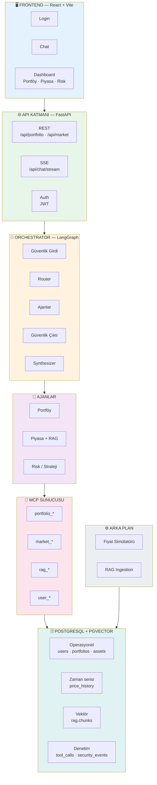

---

# 1 · KATMAN SORUMLULUKLARI

| Katman | Yapar | ASLA Yapmaz |
|---|---|---|
| **Frontend** | Görüntüler, kullanıcı girdisi alır, SSE tüketir | LLM'e doğrudan gitmez, hesap yapmaz |
| **API** | HTTP, JWT, oturum, kalıcılık | Ajan mantığı barındırmaz |
| **Orchestrator** | Karar verir, ajanları koordine eder, sentezler | DB'ye dokunmaz |
| **Ajanlar** | Kendi alanında analiz üretir | Birbirini çağırmaz, DB'ye dokunmaz |
| **MCP** | Veri ve domain servislerini dışa açar | İş mantığı barındırmaz |
| **Arka plan** | Fiyat üretir, doküman gömer | İstek akışına karışmaz |
| **DB** | Tek gerçek kaynağı, hesap view'ları | — |

---

# 2 · UÇTAN UCA AKIŞ

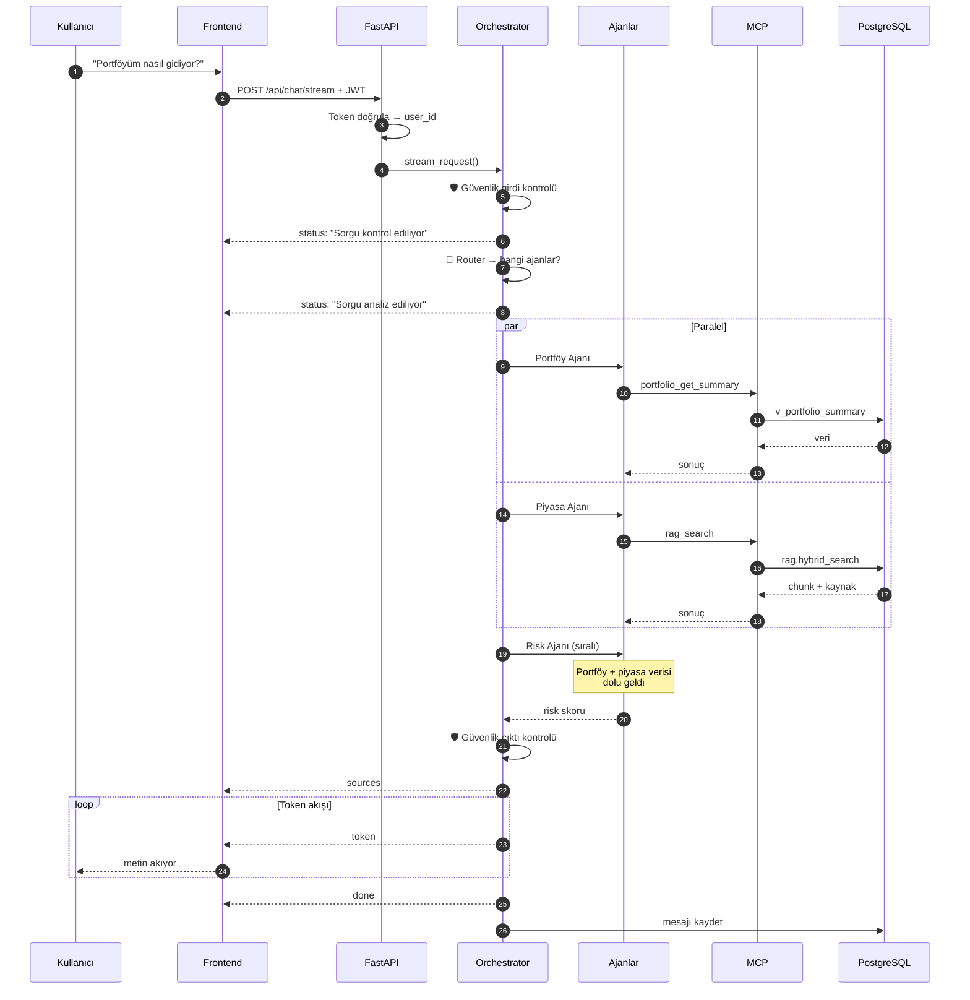

---

# 3 · FRONTEND MİMARİSİ

## 3.1 Teknoloji

| Alan | Seçim |
|---|---|
| Framework | React 18 + TypeScript |
| Stil | Tailwind CSS + shadcn/ui |
| Sunucu durumu | TanStack Query |
| İstemci durumu | Zustand (chat akışı) |
| Grafik | Recharts |
| Yönlendirme | React Router |
| Form | React Hook Form + Zod |

## 3.2 Sayfa Haritası

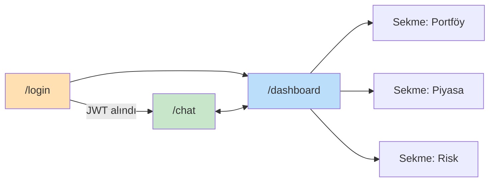

Piyasa ve Risk **ayrı sayfa değil, sekme**.

## 3.3 Bileşen Ağacı

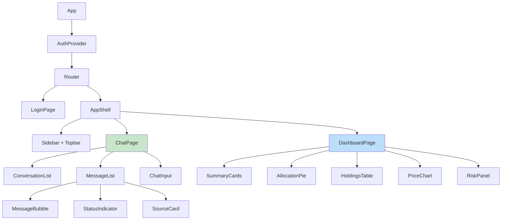

## 3.4 Veri Akışı — Hangi Bileşen Nereden Beslenir

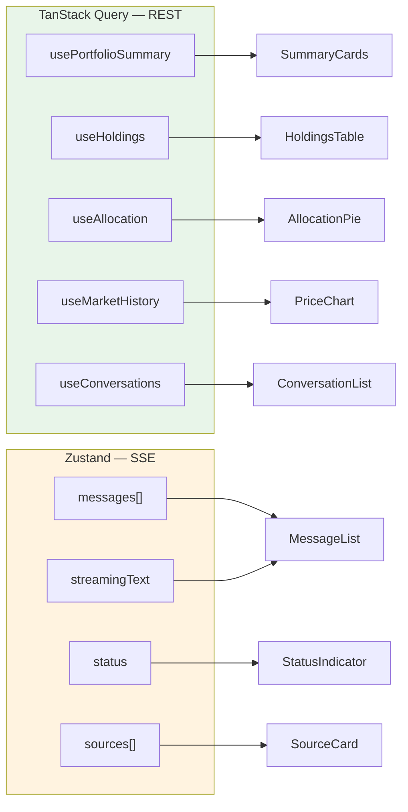

## 3.5 SSE Tüketim Durum Makinesi

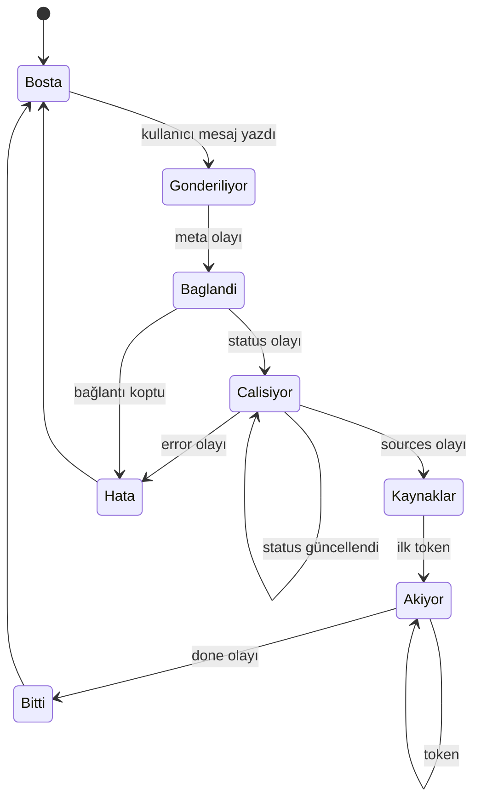

## 3.6 ⚠️ Kritik Teknik Not

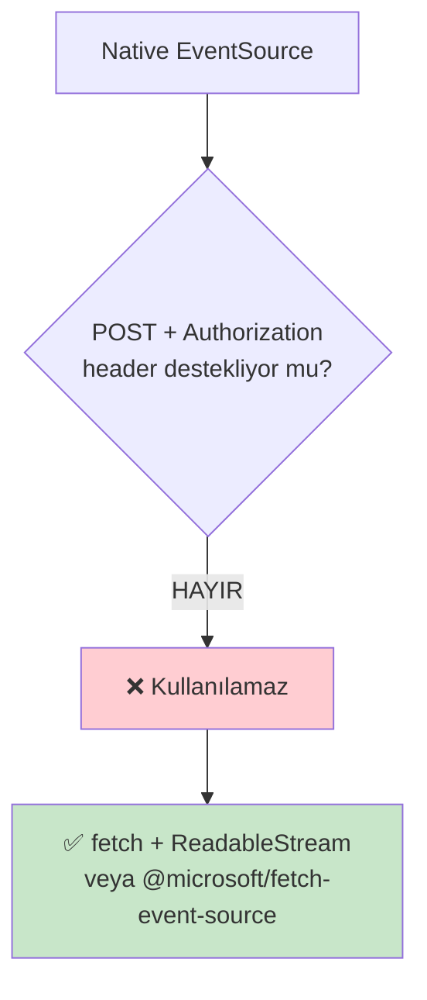

Chat ucu POST + JWT header gerektiriyor; tarayıcının yerleşik `EventSource`
yalnızca GET destekler ve header gönderemez.

## 3.7 Klasör Yapısı

```
web/src/
├── app/            router, providers, layout
├── pages/          login · chat · dashboard
├── features/
│   ├── auth/       useAuth, AuthProvider, token
│   ├── chat/       useChatStream, chatStore, bileşenler
│   ├── portfolio/  query hook'ları, tablo, pasta
│   └── market/     fiyat grafiği, varlık listesi
├── components/ui/  shadcn primitifleri
├── lib/            apiClient, sseClient, formatters
└── types/          API kontrat tipleri
```

---

# 4 · BACKEND — ORCHESTRATOR GRAFI

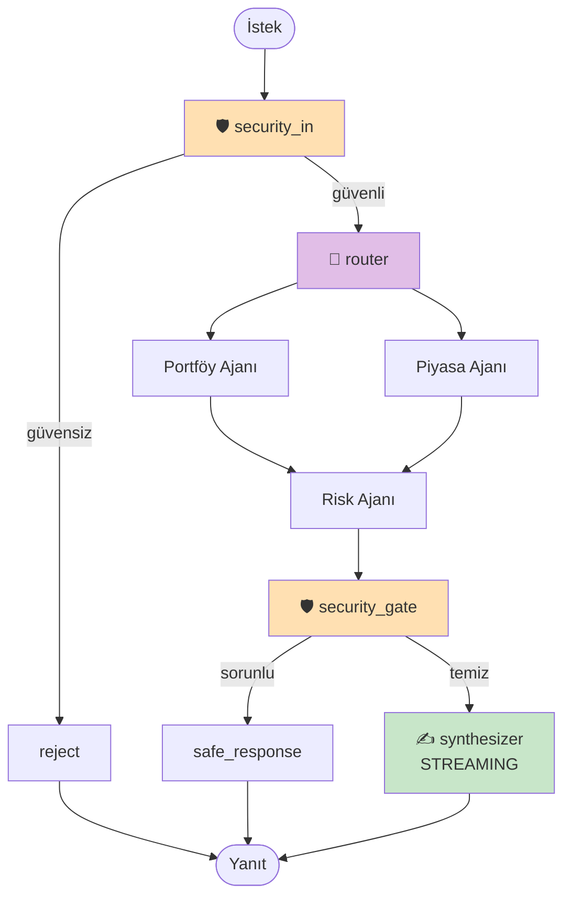

## 4.1 Ajan Bağımlılık Kuralı

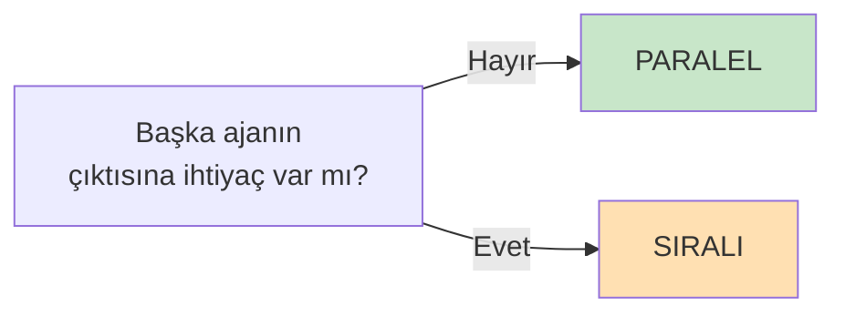

| Ajan | İhtiyacı | Konum |
|---|---|---|
| Portföy | yok | Paralel |
| Piyasa | yok | Paralel |
| Risk | portföy + piyasa | **Sıralı** |
| Synthesizer | hepsi | En son |

## 4.2 AgentState

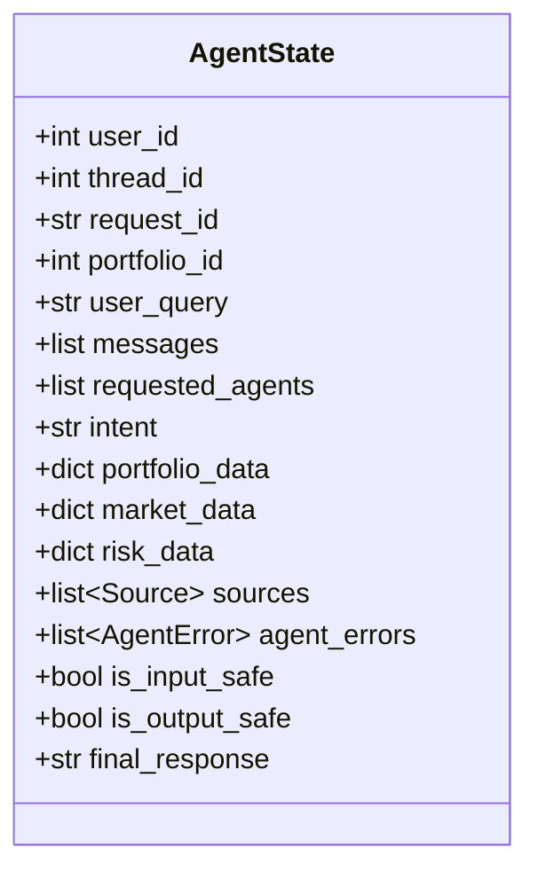

| Alan | Reducer | Neden |
|---|---|---|
| `sources` | `operator.add` | İki ajan da yazabilir |
| `agent_errors` | `operator.add` | İki ajan da yazabilir |
| `messages` | `add_messages` | LangGraph standardı |
| `portfolio_data` / `market_data` / `risk_data` | yok | Her ajan kendi alanına yazar |

## 4.3 Kısmi Başarısızlık

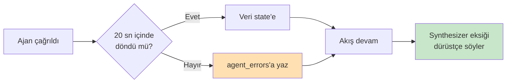

## 4.4 Klasör Yapısı

```
api/app/
├── main.py           FastAPI, SSE ucu, lifespan
├── config.py         Settings
├── core/             context (user_id, request_id), logging, errors
├── schema/           AgentState, Source, AgentError, RouterDecision
├── auth/             JWT, bağımlılıklar
├── routes/           auth · portfolio · market · conversations · chat
├── mcp/              server.py (tool'lar) · client.py
├── agents/           base · portfolio · market_research · risk · security
├── engine/           orchestrator.py (graph, router, synthesizer)
├── rag/              ingestion.py · retrieval.py · embedding.py
└── market/           provider.py · scheduler.py
```

---

# 5 · MCP KATMANI

## 5.1 Yetkilendirme

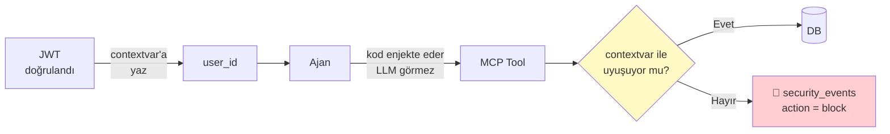

## 5.2 Tool Kataloğu

| # | Tool | LLM'in gördüğü | Kullanan |
|---|---|---|---|
| 1 | `user_get_profile` | — | Risk |
| 2 | `portfolio_get_summary` | — | Portföy |
| 3 | `portfolio_get_holdings` | — | Portföy |
| 4 | `portfolio_get_allocation` | — | Portföy |
| 5 | `portfolio_get_transactions` | `limit` | Portföy |
| 6 | `market_get_quote` | `symbol` | Piyasa · Risk |
| 7 | `market_get_history` | `symbol, days` | Piyasa · Risk |
| 8 | `rag_search` | `query, top_k, sirket?, tip?` | Piyasa |

**Dönüş zarfı (tümü aynı):**
```json
{ "ok": true, "data": {}, "error": null }
```

## 5.3 Ajan → Tool Matrisi

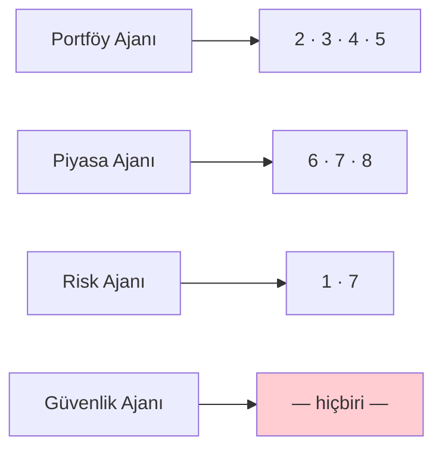

## 5.4 Kurallar

| Kural | |
|---|---|
| `user_id` tool şemasında **yok** | Prompt injection'ı engeller |
| Tüm parasal değerler **TRY normalize** | Alan adları `*_try` |
| `rag_search` **yapılandırılmış** döner | Kaynak metadata'sı kaybolmasın |
| `market_get_history` **özet** döner | LLM bağlamı şişmesin |
| Her çağrı `tool_calls`'a yazılır | Denetim + demo |

---

# 6 · RAG PIPELINE

## 6.1 Ingestion (çevrimdışı, arka plan)

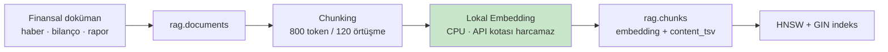

## 6.2 Retrieval (çevrimiçi, istek anında)

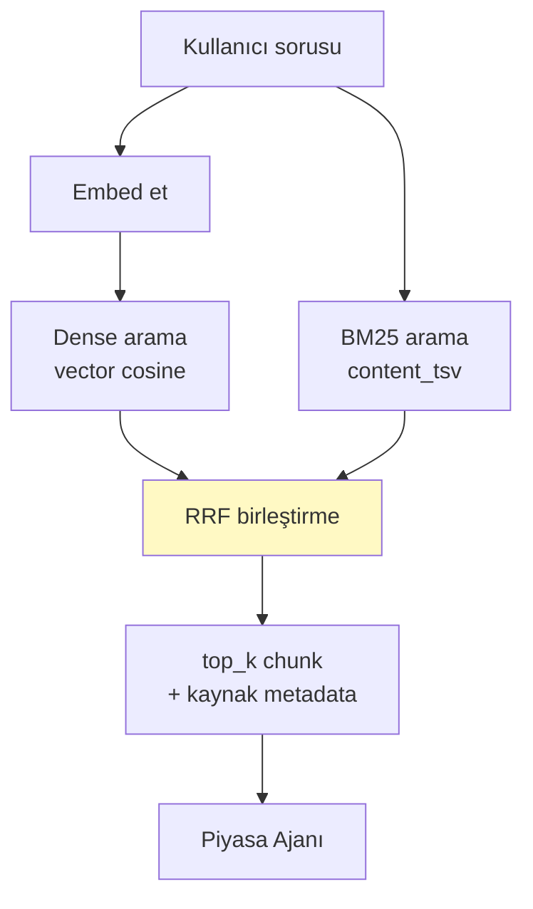

**Neden hibrit:** saf vektör araması `THYAO`, `2026 Q2` gibi tam eşleşme
gerektiren terimleri kaçırır.

## 6.3 LlamaIndex Sınırı

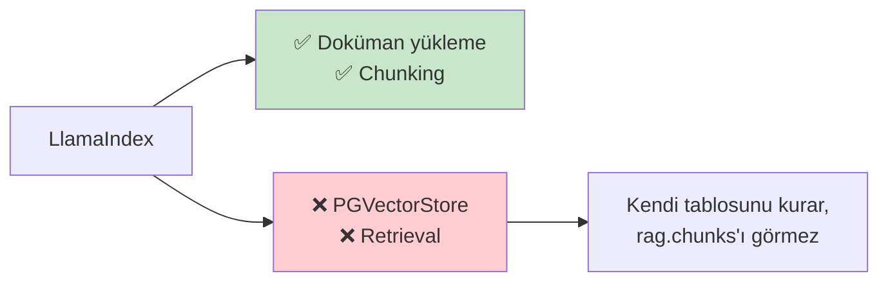

---

# 7 · PİYASA VERİSİ KATMANI

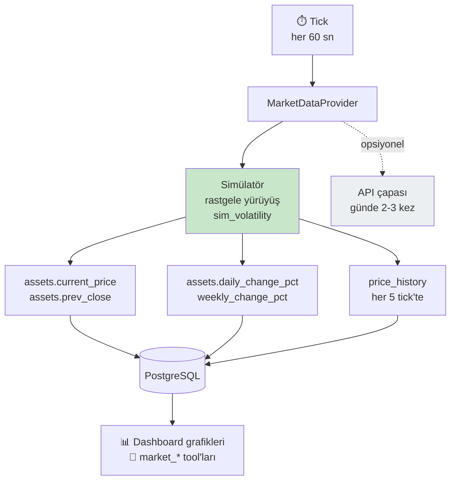

| Kural | |
|---|---|
| Varsayılan `simulated` | Kota yok, deterministik, çevrimdışı |
| `daily/weekly_change_pct` **yeniden hesaplanır** | Yoksa seed değerinde donar |
| Ajanlar fiyat **üretmez** | Sadece DB'den okur |
| Bu katman istek akışından **bağımsız** | Ayrı asyncio görevi |

---

# 8 · VERİ MODELİ

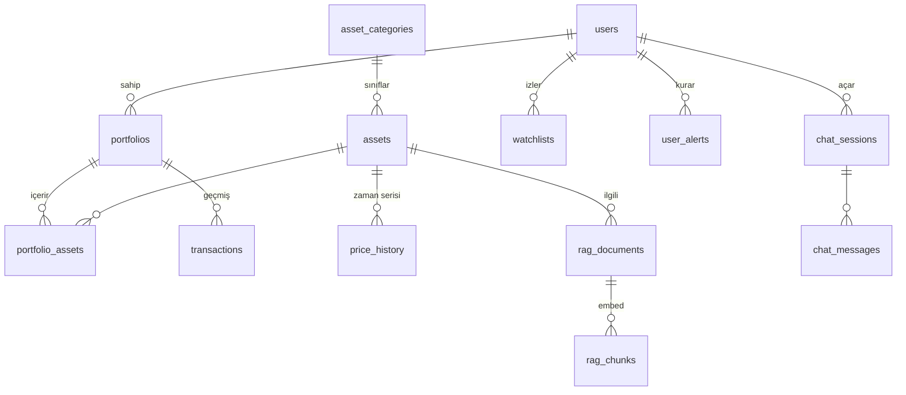

## 8.1 Tablo Sorumlulukları

| Grup | Tablolar | Sahip |
|---|---|---|
| Kimlik | `users` | Backend |
| Varlık | `asset_categories` · `assets` | Backend |
| Portföy | `portfolios` · `portfolio_assets` · `transactions` | Backend |
| Zaman serisi | `price_history` | Piyasa katmanı |
| Sohbet | `chat_sessions` · `chat_messages` | Orchestrator |
| Denetim | `tool_calls` · `security_events` | MCP + Güvenlik |
| Vektör | `rag.documents` · `rag.chunks` | RAG grubu |
| Kapsam dışı | `watchlists` · `user_alerts` | — |

## 8.2 Hesap Sahipliği

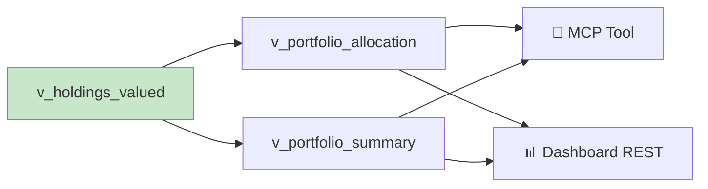

> Hesap **tek yerde**: view. Ajan da dashboard da aynı view'ı okur.
> İki yerde hesaplarsanız iki farklı toplam görürsünüz.

## 8.3 Para Birimi

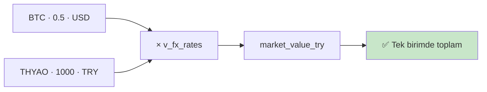

---

# 9 · GÜVENLİK

```mermaid
flowchart TD
    A["Kullanıcı girdisi"] --> B["🛡️ KAPI 1<br/>security_in"]
    B --> C{"Kural motoru<br/>LLM'siz"}
    C -->|temiz| D["Router"]
    C -->|şüpheli| E["Küçük LLM<br/>risk skoru"]
    E -->|güvenli| D
    E -->|riskli| F["🚫 Reddet"]

    D --> G["Ajanlar"]
    G --> H["🛡️ KAPI 2<br/>security_gate"]
    H --> I{"RAG içeriğinde<br/>enjeksiyon var mı?"}
    I -->|hayır| J["Synthesizer<br/>STREAMING"]
    I -->|evet| K["🚫 Güvenli yanıt"]

    F --> L[("security_events")]
    K --> L

    style B fill:#ffe0b2
    style H fill:#ffe0b2
    style F fill:#ffcdd2
    style K fill:#ffcdd2
```

| Tehdit | Kontrol |
|---|---|
| Prompt injection (kullanıcı) | Kapı 1 — kural motoru + LLM |
| Dolaylı injection (RAG dokümanı) | Kapı 2 — chunk metni taranır |
| Başka kullanıcının verisi | MCP contextvar doğrulaması |
| Yetkisiz konuşma erişimi | `conversation_id` sahiplik kontrolü |
| PII sızıntısı | Log ve `tool_calls.args` maskeleme |
| Yatırım tavsiyesi algısı | Synthesizer sistem promptu |

**Neden Kapı 2 sentezden önce:** token gönderildikten sonra geri alınamaz.

---

# 10 · KONTRATLAR

## 10.1 SSE Olayları

```jsonc
{"type":"meta",        "request_id":"…", "conversation_id":1}
{"type":"status",      "stage":"security|routing|agents|risk|synth", "message":"…"}
{"type":"sources",     "items":[{"doc_id","baslik","sirket","tarih","tip","score"}]}
{"type":"token",       "content":"Portföyünüzün "}
{"type":"agent_error", "agent":"market_research", "error_type":"timeout"}
{"type":"error",       "code":"LLM_UNAVAILABLE"}
{"type":"done",        "message_id":42, "latency_ms":8420}
```

**Sıra garantisi:** `meta` ilk · `sources` ilk `token`'dan önce · `done` son.

## 10.2 Router Kararı

```python
class RouterDecision(BaseModel):
    intent: Literal["portfoy","piyasa","risk","karma","sohbet","belirsiz"]
    agents: list[Literal["portfolio","market_research","risk_strategy"]]
    needs_clarification: bool = False
    clarifying_question: str | None = None
    reasoning: str
```

```mermaid
flowchart LR
    A["sohbet"] --> B["1-2 LLM çağrısı"]
    C["tam akış"] --> D["5-7 LLM çağrısı"]
    style B fill:#c8e6c9
    style D fill:#ffe0b2
```

## 10.3 REST Uçları

| Metot | Yol | Besler |
|---|---|---|
| POST | `/api/auth/login` | Login |
| GET | `/api/auth/me` | AppShell |
| GET | `/api/portfolio/summary` | SummaryCards |
| GET | `/api/portfolio/holdings` | HoldingsTable |
| GET | `/api/portfolio/allocation` | AllocationPie |
| GET | `/api/market/assets` | Piyasa sekmesi |
| GET | `/api/market/history` | PriceChart |
| GET | `/api/conversations` | ConversationList |
| GET | `/api/conversations/{id}/messages` | MessageList |
| POST | `/api/chat/stream` | Chat (SSE) |
| GET | `/health` | — |

---

# 11 · GENİŞLETME NOKTALARI

## 11.1 Yeni Ajan Ekleme

```mermaid
flowchart LR
    A["1· BaseAgent'tan türet"] --> B["2· AgentState'e<br/>çıktı alanı ekle"]
    B --> C["3· RouterDecision<br/>Literal'ına ekle"]
    C --> D["4· Graph'a node + kenar"]
    D --> E["5· Tool matrisine ekle"]
    E --> F["6· Synthesizer promptunu<br/>güncelle"]
```

**Kural:** Başka ajanın çıktısına ihtiyaç duyuyorsa sıralı, duymuyorsa paralel.

## 11.2 Yeni MCP Tool Ekleme

```mermaid
flowchart LR
    A["1· mcp/server.py'a<br/>@mcp.tool"] --> B["2· Ortak zarfı döndür"]
    B --> C["3· user_id'yi<br/>contextvar'dan al"]
    C --> D["4· Ajan tool<br/>listesine ekle"]
```

## 11.3 Yeni Sayfa / Grafik Ekleme

```mermaid
flowchart LR
    A["1· DB view'ı"] --> B["2· REST ucu"]
    B --> C["3· Query hook"]
    C --> D["4· Bileşen"]
```

## 11.4 Ölçeklenme Yolu (proje sonrası)

```mermaid
flowchart LR
    A["Modular Monolith<br/>tek container"] -.->|"gerekirse"| B["Ajan servisleri ayrılır"]
    A -.->|"gerekirse"| C["Vektör DB ayrılır"]
    A -.->|"gerekirse"| D["Redis cache + kuyruk"]
    style A fill:#c8e6c9
```
