# SYSTEM ARCHITECTURE v4.1
## Akıllı Kişisel Finans Danışmanı

**Durum:** v2.3 (backend derinliği) ve v3 (sistem geneli) dokümanlarının birleştirilmiş hâli.
**Bu doküman tek geçerli mimari referanstır** — v2.x ve v3 arşive alınmalıdır.

---

# 0 · BU DOKÜMAN HAKKINDA

## 0.1 Neyi birleştiriyor

| Kaynak | Buraya taşınan içerik |
|---|---|
| **v3** | Sistem haritası, uçtan uca akış, frontend mimarisi, veri modeli, RAG pipeline, MCP yetkilendirme ve tool kataloğu, güvenlik tehdit tablosu, genişletme noktaları |
| **v2.3** | Kod düzeyinde iskeletler, modular monolith gerekçesi, piyasa verisi katmanının kota matematiği, gereksinim izlenebilirliği, modül bazlı sorumluluk tablosu, açık kararlar |

İki doküman dört noktada birbiriyle çelişiyordu. Bunlar bölüm **10**'da tek sözleşmede toplandı; her birinin yanında hangi sürümden geldiği ve gerekçesi yazılı. **⚖️ ile işaretli maddeler ekip onayı bekliyor.**

## 0.2 Doküman ↔ kod farkı

Bu doküman bugünkü kodu değil, **hedef mimariyi** anlatır. Aradaki güncel farklar bölüm **14**'te listelidir; oradaki her satır bir iş kalemidir.

---

# 1 · SİSTEM HARİTASI

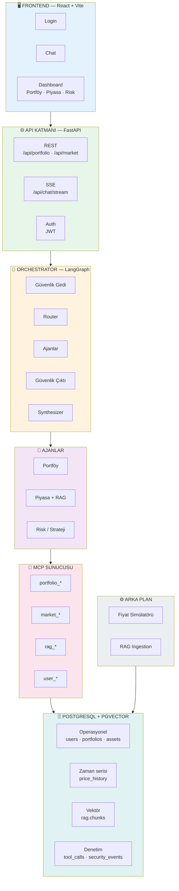

## 1.1 Katman Sorumlulukları

| Katman | Yapar | ASLA Yapmaz |
|---|---|---|
| **Frontend** | Görüntüler, kullanıcı girdisi alır, SSE tüketir | LLM'e doğrudan gitmez, hesap yapmaz |
| **API** | HTTP, JWT, oturum, kalıcılık | Ajan mantığı barındırmaz |
| **Orchestrator** | Karar verir, ajanları koordine eder, sentezler | DB'ye dokunmaz |
| **Ajanlar** | Kendi alanında analiz üretir | Birbirini çağırmaz, DB'ye dokunmaz |
| **MCP** | Veri ve domain servislerini dışa açar | İş mantığı barındırmaz |
| **Arka plan** | Fiyat üretir, doküman gömer | İstek akışına karışmaz |
| **DB** | Tek gerçek kaynağı, hesap view'ları | — |

---

# 2 · TEKNOLOJİ KARARLARI

| Alan | Karar | Not |
|---|---|---|
| Dil / Runtime | **Python 3.13** | 3.14'ü LangGraph henüz desteklemiyor |
| Web framework | FastAPI + Uvicorn | |
| Orkestrasyon | LangGraph (StateGraph) | |
| RAG katmanı | LlamaIndex — **yalnızca yükleme + chunking** | Retrieval kendi kodumuzda (bkz. 7.3) |
| Vector DB | **pgvector** (PostgreSQL üzerinde) | Chroma yerine; bir container az |
| İlişkisel DB | PostgreSQL 16 | pgvector eklentili imaj gerekli |
| Tool katmanı | **Tek MCP sunucusu**, tool grupları | Üç ayrı sunucu değil |
| LLM sağlayıcı | **Google Gemini** (`google-genai`) | v2.3'te NVIDIA yazıyordu; repo Gemini'ye geçti |
| Embedding modeli | **KARAR VERİLMEDİ** — RAG grubu | Türkçe retrieval performansı belirleyici |
| Sistem dili | **Türkçe** (arayüz, sorgu, doküman, yanıt) | |
| Streaming | **SSE** (WebSocket değil) | Akış tek yönlü |
| Deployment | **Tek container / modular monolith** | Ajanlar ayrı servis DEĞİL |
| Piyasa verisi | Hibrit: simülatör (varsayılan) + opsiyonel API | `MARKET_DATA_PROVIDER` ile seçilir |
| Portföy verisi | Sentetik (dummy data) | |

## 2.1 Neden Modular Monolith?

| Kriter | Mikroservis | Modular Monolith (seçilen) |
|---|---|---|
| Ajanlar arası iletişim | Ağ üzerinden (HTTP/gRPC) → gecikme | In-process çağrı → ~0ms |
| Deployment karmaşıklığı | Yüksek (N servis) | Düşük (1 container) |
| MCP Client yönetimi | Her serviste ayrı client | Tek, paylaşılan client |
| Ekip için uygunluk | Büyük ekip gerektirir | Küçük/orta ekip için ideal |
| Hata ayıklama | Dağıtık trace | Tek log akışı |
| Ölçeklenme | Servis bazlı | Süreç içi modüler, ileride ayrıştırılabilir |

Ayrı servis kararı çıkarsa yalnızca `engine/orchestrator.py` içeriği değişir; endpoint ve frontend etkilenmez.

---

# 3 · UÇTAN UCA AKIŞ

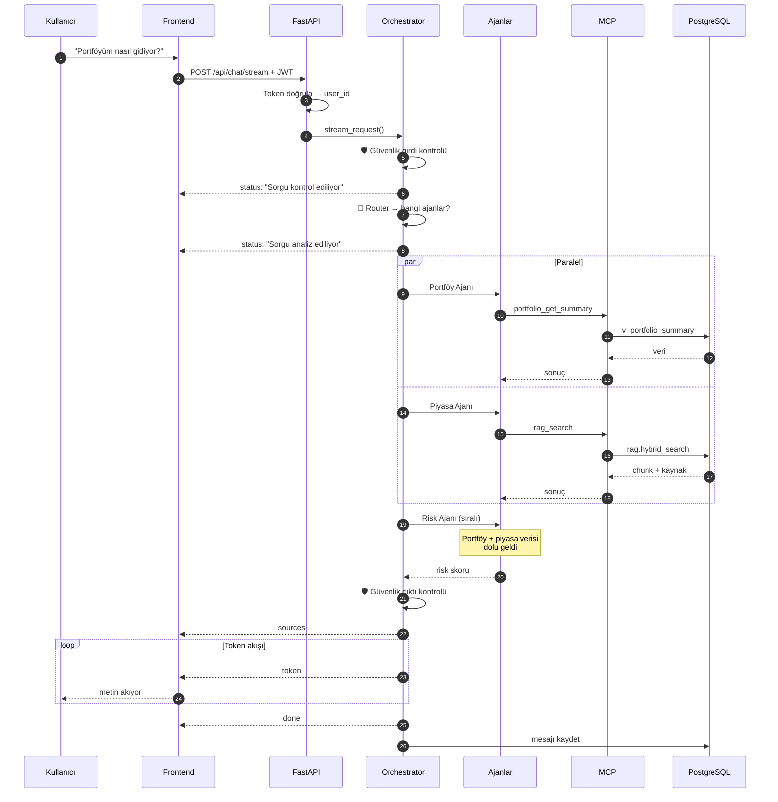

> **Kısmi başarısızlık:** Bir ajan timeout olur veya hata verirse akış durmaz; hata `agent_errors`'a yazılır ve synthesizer eksik veriyle dürüst bir yanıt üretir ("piyasa verisine şu anda ulaşılamadı"). Demo sırasında tek ajanın çökmesi tüm sistemi düşürmez.

---

# 4 · FRONTEND MİMARİSİ

## 4.1 Teknoloji

| Alan | Seçim |
|---|---|
| Framework | React 18 + TypeScript |
| Stil | Tailwind CSS + shadcn/ui |
| Sunucu durumu | TanStack Query |
| İstemci durumu | Zustand (chat akışı) |
| Grafik | Recharts |
| Yönlendirme | React Router |
| Form | React Hook Form + Zod |

## 4.2 Sayfa Haritası

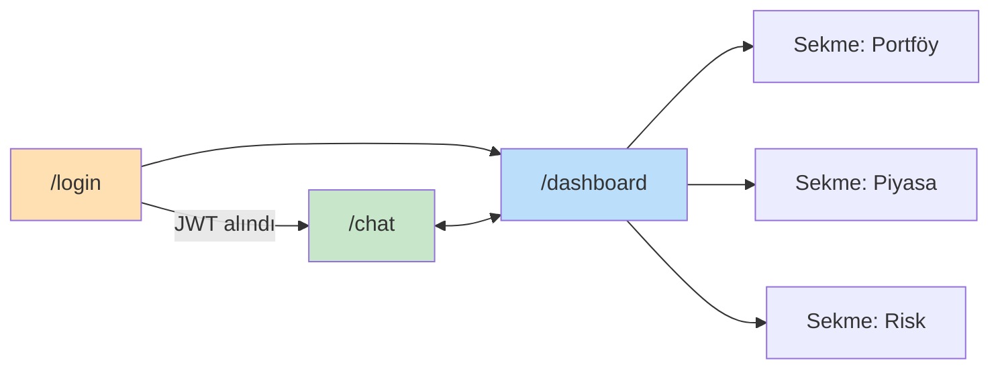

Piyasa ve Risk **ayrı sayfa değil, sekme**.

## 4.3 Bileşen Ağacı

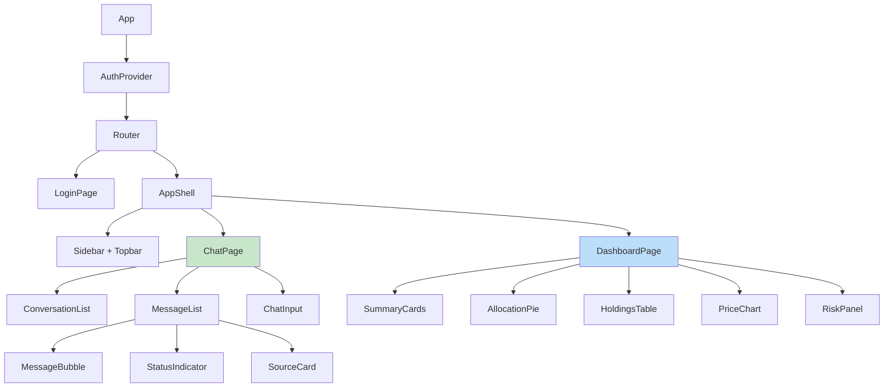

## 4.4 Veri Akışı — Hangi Bileşen Nereden Beslenir

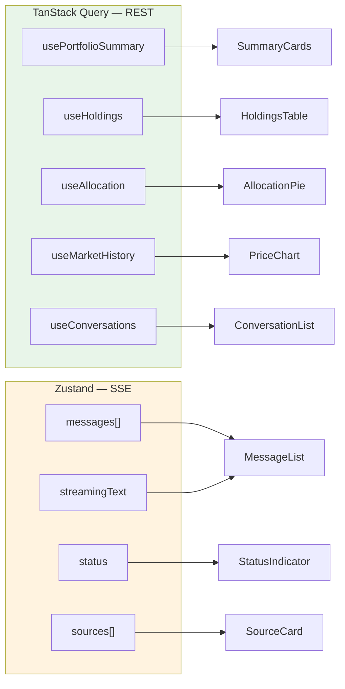

## 4.5 SSE Tüketim Durum Makinesi

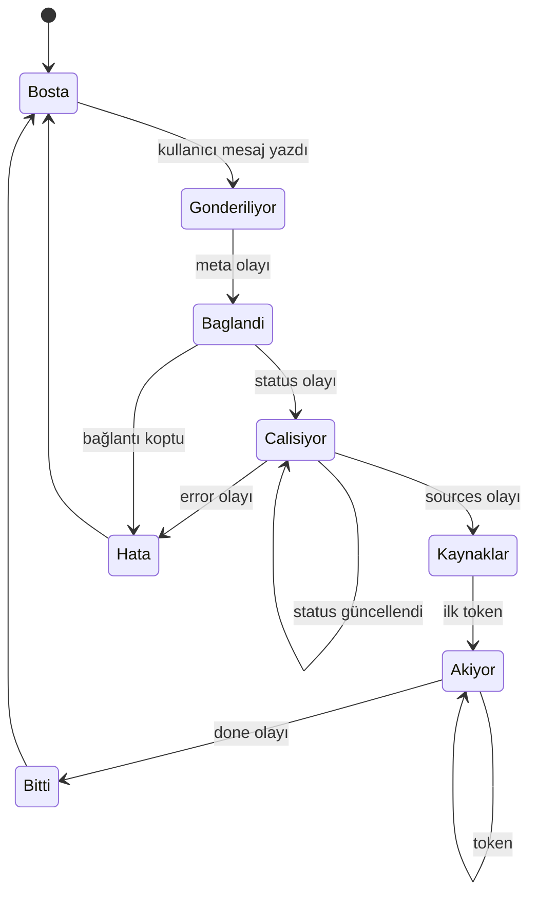

## 4.6 ⚠️ Kritik Teknik Not

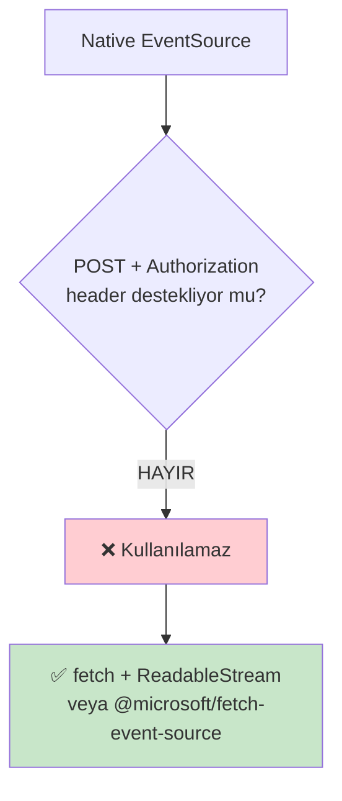

Chat ucu POST + JWT header gerektiriyor; tarayıcının yerleşik `EventSource` yalnızca GET destekler ve header gönderemez.

## 4.7 Klasör Yapısı

```
frontend/src/
├── app/            router, providers, layout
├── pages/          login · chat · dashboard
├── features/
│   ├── auth/       useAuth, AuthProvider, token
│   ├── chat/       useChatStream, chatStore, bileşenler
│   ├── portfolio/  query hook'ları, tablo, pasta
│   └── market/     fiyat grafiği, varlık listesi
├── components/ui/  shadcn primitifleri
├── lib/            apiClient, sseClient, formatters
└── types/          API kontrat tipleri
```

> v3'te bu klasör `web/src/` yazıyordu; repodaki gerçek dizin `frontend/src/` olduğu için düzeltildi.

---

# 5 · BACKEND — ORCHESTRATOR

## 5.1 Graph

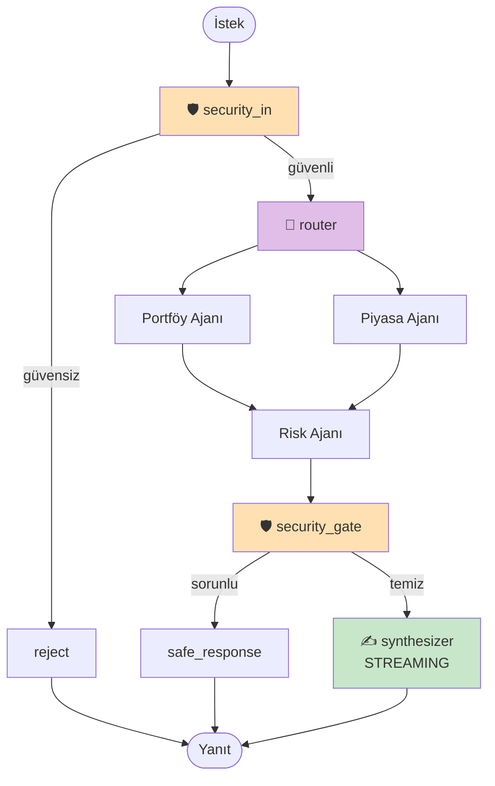

## 5.2 Ajan Bağımlılık Kuralı

**Bir ajan başka bir ajanın çıktısına ihtiyaç duyuyorsa SIRALI, duymuyorsa PARALEL konumlanır.**

| Ajan | İhtiyacı | Konum |
|---|---|---|
| Portföy | yok (yalnızca `user_id` + MCP) | Paralel |
| Piyasa | yok (yalnızca sorgu + RAG) | Paralel |
| Risk | `portfolio_data` **ve** `market_data` | **Sıralı** |
| Synthesizer | hepsi | En son |

> **Neden bu düzeltme yapıldı:** v1'de üç ajan da paralel fan-out'taydı. Risk ajanı portföy ve piyasa verisine göre skor üretiyor; paralel çalıştığında bu alanlar henüz `None` olduğu için ajan boş veriyle çalışıyordu. Bu, **hata fırlatmayan ama yanlış sonuç üreten** türden sessiz bir hatadır.

**Paralellik LangGraph kenarlarıyla kurulur, tek node içinde `asyncio.gather` ile değil.** Aksi hâlde node bazlı ilerleme olayı, checkpoint ve hata izolasyonu kaybolur.

**Gecikme bedeli:** Paralel tasarımda toplam süre "en yavaş ajan + synthesizer" iken, sıralı risk ile "paralel faz + risk + synthesizer" olur. NFR-01 (ilk token) için hafifletme: Risk ajanına küçük/hızlı model (`RISK_MODEL`) ve paralel faz sırasında ilerleme mesajı akıtmak.

## 5.3 AgentState

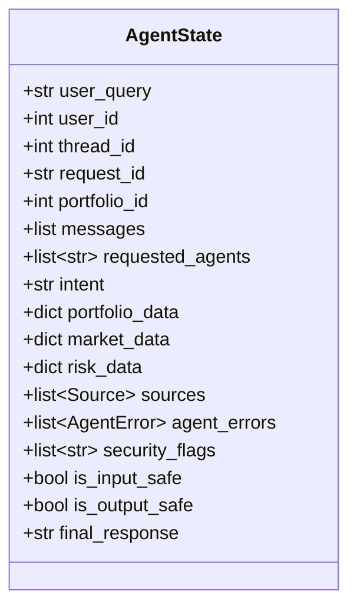

| Alan | Reducer | Neden |
|---|---|---|
| `sources` | `operator.add` | İki ajan da yazabilir |
| `agent_errors` | `operator.add` | İki ajan da yazabilir |
| `security_flags` | `operator.add` | İki güvenlik node'u da yazabilir |
| `messages` | `add_messages` | LangGraph standardı |
| `portfolio_data` / `market_data` / `risk_data` | yok | Her ajan kendi alanına yazar |

> ⚖️ **Karar:** `user_id` ve `thread_id` **`int`** olmalıdır — DB'de `users.id` ve `chat_sessions.id` `SERIAL`, MCP yetkilendirmesi (bölüm 6.1) bu değerin karşılaştırılmasına dayanıyor. Mevcut kod `str` kullanıyor; tip dönüşümü sınırda bir kez yapılmalı.

> ⚠️ **Reducer tuzağı:** `operator.add` alanları tur başında **sıfırlanmaz**. Aynı `thread_id` ile ikinci tura girildiğinde `sources` ve `agent_errors` önceki turun değerlerinin üzerine eklenir; başlangıç state'ine `[]` yazmak işe yaramaz (reducer "hiçbir şey ekleme" olarak uygular). Tur başında temizleyen bir sentinel reducer gerekir.

```python
# app/schema/models.py — çekirdek modeller
class Source(BaseModel):
    """RAG yanıtının dayandığı kaynak doküman — FR-RAG-04 izlenebilirlik."""
    doc_id: str
    baslik: str
    sirket: str | None = None
    tarih: str | None = None
    tip: str | None = None          # haber | bilanco | analist_raporu | duyuru
    score: float | None = None


class AgentError(BaseModel):
    """Bir ajanın başarısızlığı — akışı DURDURMAZ, kısmi yanıt üretilir."""
    agent_name: str
    error_type: Literal["timeout", "tool_error", "llm_error", "unknown"]
    message: str


class ToolResult(BaseModel):
    """MCP tool çağrısının sonucu. latency_ms izlenebilirlik için (NFR-05)."""
    tool_name: str
    output: dict
    latency_ms: float
    success: bool = True
    error: str | None = None
```

## 5.4 Kısmi Başarısızlık

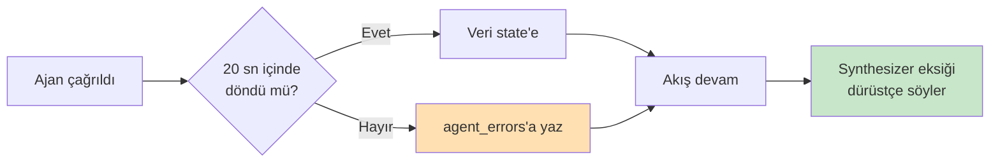

Timeout ve hata yakalama **`BaseAgent.run()` içinde merkezîdir**; alt sınıflar yalnızca `_execute()` yazar:

```python
# app/agents/base.py
class BaseAgent(ABC):
    """run() AgentState değil DICT döner: LangGraph node'ları yalnızca DEĞİŞEN
    alanları döndürür; tüm state'i döndürmek paralel çalışmada overwrite hatası
    üretir."""
    name: str

    def __init__(self, mcp_client, llm, timeout_seconds: int): ...

    @abstractmethod
    async def _execute(self, state: AgentState) -> dict:
        """Asıl iş mantığı. Örn: {"portfolio_data": {...}}"""

    async def run(self, state: AgentState) -> dict:
        try:
            return await asyncio.wait_for(self._execute(state), self.timeout_seconds)
        except asyncio.TimeoutError:
            return {"agent_errors": [AgentError(
                agent_name=self.name, error_type="timeout",
                message=f"{self.timeout_seconds}s içinde yanıt alınamadı")]}
        except Exception as exc:
            return {"agent_errors": [AgentError(
                agent_name=self.name, error_type="unknown", message=str(exc))]}

    async def call_tool(self, server: str, tool: str, arguments: dict) -> dict:
        """MCP çağrısını yapar, süresini ToolResult olarak loglar."""

    def is_requested(self, state: AgentState) -> bool:
        """Router bu ajanı istemediyse ajan kendini erken sonlandırır (ucuz no-op)."""
```

## 5.5 Ajanlar

```python
# app/agents/market_research.py
class MarketResearchAgent(BaseAgent):
    name = "market_research"

    async def _execute(self, state) -> dict:
        """RAG üzerinden haber/bilanço araması. Kaynak metadata'sını
        state.sources'a taşır (FR-RAG-04)."""
        return {"market_data": ..., "sources": [...]}   # sources reducer ile birikir


# app/agents/portfolio.py
class PortfolioAgent(BaseAgent):
    name = "portfolio"

    async def _execute(self, state) -> dict:
        """MCP portfolio_* tool'ları üzerinden veri çeker.
        DB'ye DOĞRUDAN erişmez (NFR-04)."""
        return {"portfolio_data": ...}


# app/agents/risk_strategy.py
class RiskStrategyAgent(BaseAgent):
    """SIRALI AJAN — fan-out'un parçası değildir."""
    name = "risk_strategy"

    async def _execute(self, state) -> dict:
        if state.portfolio_data is None:      # savunmacı kontrol
            return {"agent_errors": [AgentError(
                agent_name=self.name, error_type="tool_error",
                message="Portföy verisi olmadan risk hesaplanamadı")]}
        return {"risk_data": ...}
```

> **Risk skoru nerede hesaplanır?** Sayı backend'de deterministik olarak hesaplanır (DB view + servis); ajan yalnızca yorumlar. Böylece dashboard ve ajan aynı skoru gösterir.

## 5.6 Orchestrator

```python
# app/engine/orchestrator.py
class Orchestrator:
    def __init__(self, agents: dict, security_agent, synthesizer_llm=None,
                 checkpointer=None, synthesizer_timeout_seconds: int = 40):
        """Ajanlar ENJEKTE edilir; orchestrator hiçbirini kendisi oluşturmaz.
        Kayıtlı olmayan ajan için kenar üretilmez — eksik ajanla da çalışır."""
        self.graph = self.build_graph().compile(checkpointer=checkpointer or MemorySaver())

    def build_graph(self) -> StateGraph: ...
    def route_node(self, state) -> dict: ...          # requested_agents doldurur
    def route_intent(self, state) -> list[str]: ...   # kural tabanlı, LLM'siz
    async def synthesize(self, state, config) -> dict:
        """config LLM çağrısına AÇIKÇA geçilmeli; aksi hâlde token'lar
        `messages` stream moduna düşmez ve streaming SESSİZCE çalışmaz."""
    async def stream_request(self, query, user_id, thread_id) -> AsyncGenerator[dict, None]:
        """FastAPI'nin çağırdığı TEK giriş noktası. String değil AsyncGenerator
        döner; string token akıtamaz."""
```

Wiring tek dosyada toplanır (`app/engine/factory.py`): hangi MCP sunucuları ayakta, hangi ajan hangi modelle çalışıyor sorularının cevabı oradadır.

---

# 6 · MCP KATMANI

## 6.1 Yetkilendirme

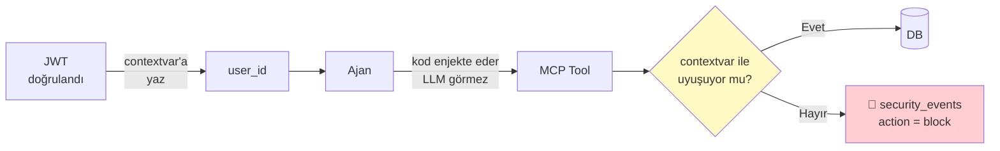

## 6.2 Tool Kataloğu

| # | Tool | LLM'in gördüğü parametreler | Kullanan |
|---|---|---|---|
| 1 | `user_get_profile` | — | Risk |
| 2 | `portfolio_get_summary` | — | Portföy |
| 3 | `portfolio_get_holdings` | — | Portföy |
| 4 | `portfolio_get_allocation` | — | Portföy |
| 5 | `portfolio_get_transactions` | `limit` | Portföy |
| 6 | `market_get_quote` | `symbol` | Piyasa · Risk |
| 7 | `market_get_history` | `symbol, days` | Piyasa · Risk |
| 8 | `rag_search` | `query, top_k, sirket?, tip?` | Piyasa |

**Dönüş zarfı (tümü aynı):**

```json
{ "ok": true, "data": {}, "error": null }
```

## 6.3 Ajan → Tool Matrisi

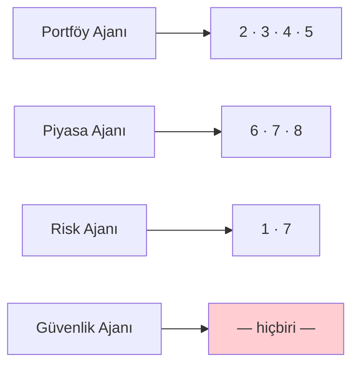

## 6.4 Kurallar

| Kural | Gerekçe |
|---|---|
| `user_id` tool şemasında **yok** | Prompt injection'ı engeller — LLM başkasının `user_id`'sini yazamaz |
| Tüm parasal değerler **TRY normalize** | Alan adları `*_try` |
| `rag_search` **yapılandırılmış** döner | Düz metin dönerse kaynak metadata'sı MCP sınırında kaybolur, FR-RAG-04 karşılanamaz |
| `market_get_history` **özet** döner | LLM bağlamı şişmesin |
| Her çağrı `tool_calls`'a yazılır | Denetim + demo |

> ⚖️ **Değişiklik:** v2.3'te tool imzaları `portfolio_get_holdings(user_id: str)` şeklindeydi. `user_id` tool parametresinden **çıkarıldı** ve contextvar'a taşındı; v3'ün yaklaşımı güvenlik açısından üstün.

```python
# app/mcp/client.py — tek/ortak instance, FastAPI lifespan'inde oluşturulur
class MCPClient:
    """Tüm ajanlar bu instance'ı paylaşır. Tek MCP sunucusu kullanılır;
    ayrım tool ADI ile yapılır: portfolio_*, market_*, rag_*, user_*"""
    def register_server(self, server: MCPServer) -> None: ...
    def has_server(self, server: str) -> bool: ...
    async def call_tool(self, server: str, tool: str, arguments: dict) -> dict: ...
```

---

# 7 · RAG PIPELINE

## 7.1 Ingestion (çevrimdışı, arka plan)

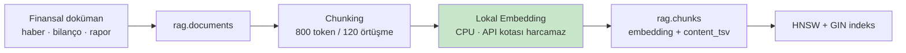

> **Kritik kural:** Embedding modeli seçilmeden **gerçek embedding üretilmez.** Yanlış modelle 200 doküman embed edilirse hepsi baştan embed edilir. `vector(1024)` boyutu **iki yerde** geçer (`rag.chunks.embedding` ve `rag.hybrid_search` parametresi) — model kararıyla ikisi birden değişir.

## 7.2 Retrieval (çevrimiçi, istek anında)

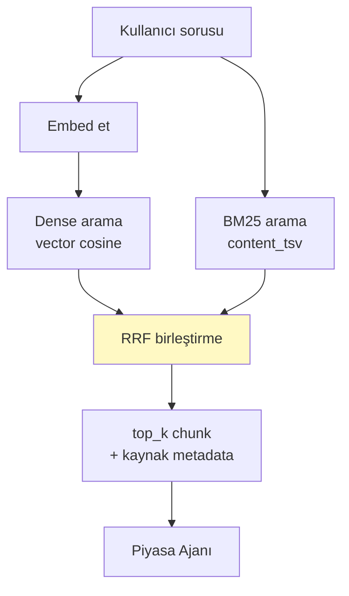

**Neden hibrit:** saf vektör araması `THYAO`, `2026 Q2` gibi tam eşleşme gerektiren terimleri kaçırır.

> **Türkçe tuzağı:** `plainto_tsquery` terimleri **AND**'ler; doğal dildeki bir sorunun tüm kelimelerinin aynı chunk'ta geçmesi neredeyse imkânsızdır. Sorgu OR'a çevrilmezse BM25 ayağı sessizce boş döner ve hibrit arama saf vektör aramasına düşer. (`db/v5_schema_and_data.sql` içinde düzeltilmiştir.)

## 7.3 LlamaIndex Sınırı

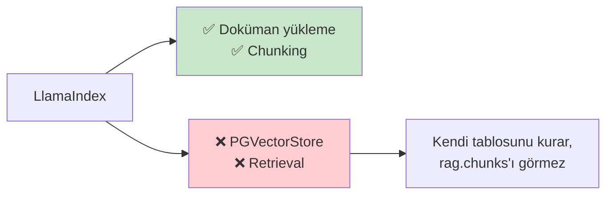

---

# 8 · PİYASA VERİSİ KATMANI

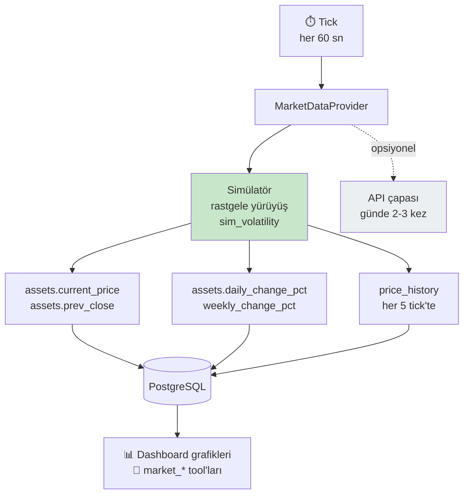

## 8.1 Neden hibrit?

| Kısıt | Etkisi |
|---|---|
| **Gecikme:** BIST verisi ücretsiz kaynaklarda 15 dk gecikmeli | Zaten "anlık" değil |
| **Kota:** ücretsiz katmanlar ayda ~500 çağrı | Dakikada bir güncelleme = ayda ~43.000 çağrı → **kotanın ~80 katı** |

Çözüm: **API çapa atar** (günde 2–3 kez gerçek fiyat, kota içinde), **simülatör arayı doldurur** (her N saniyede baz fiyat üzerinde rastgele yürüyüş). API çökerse veya kota biterse sistem simülatörle devam eder — demo günü risk sıfırlanır.

## 8.2 Kurallar

| Kural | |
|---|---|
| Varsayılan `simulated` | Kota yok, deterministik, çevrimdışı |
| `daily/weekly_change_pct` **yeniden hesaplanır** | Yoksa seed değerinde donar |
| Ajanlar fiyat **üretmez** | Sadece DB'den okur |
| Bu katman istek akışından **bağımsız** | Ayrı asyncio görevi |

```python
# app/market/provider.py
class MarketDataProvider(ABC):
    """Fiyat kaynağı soyutlaması. Ajanlar ve MCP tool'ları hangi
    implementasyonun çalıştığını BİLMEZ."""
    @abstractmethod
    async def fetch_prices(self, symbols: list[str]) -> dict[str, float]: ...


class SimulatedMarketProvider(MarketDataProvider):
    """Varsayılan. Demo tekrarlanabilirliği için SABİT SEED kullanılır:
    prova edilen senaryo sunumda birebir aynı çıkar."""


class ApiMarketProvider(MarketDataProvider):
    """Ücretsiz API. Kota koruması ZORUNLU: günlük sayaç, hata/timeout
    durumunda simülatöre düşme, çekilen fiyatın baz fiyat olarak yazılması."""
```

```python
# app/market/scheduler.py — FastAPI lifespan içinde başlatılır
async def price_tick(provider: MarketDataProvider) -> None:
    while True:
        await update_prices(provider)
        await asyncio.sleep(settings.price_tick_seconds)
```

## 8.3 Karar tablosu

| Senaryo | Ayar | Gerekçe |
|---|---|---|
| Geliştirme / test | `simulated` | Kota yok, deterministik, çevrimdışı |
| Demo / sunum | `simulated` | Senaryo kontrol edilebilir, kesinti riski yok |
| "Gerçek veri de var" göstermek | `hybrid` | Kota içinde gerçek çapa + akıcı hareket |
| Canlı ortam | — | Kapsam dışı; gerçek para/emir işlemi yok |

> Gerçek API kullanımı **PO onayı** gerektirir (lisans ve veri kullanım şartları).

---

# 9 · VERİ MODELİ

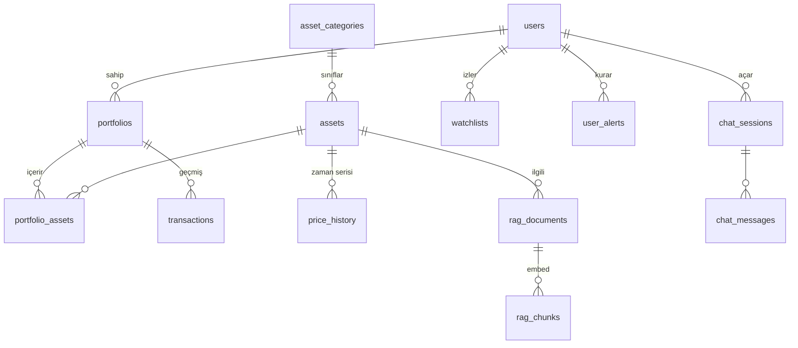

## 9.1 Tablo Sorumlulukları

| Grup | Tablolar | Sahip |
|---|---|---|
| Kimlik | `users` | Backend |
| Varlık | `asset_categories` · `assets` | Backend |
| Portföy | `portfolios` · `portfolio_assets` · `transactions` | Backend |
| Zaman serisi | `price_history` | Piyasa katmanı |
| Sohbet | `chat_sessions` · `chat_messages` | Orchestrator |
| Denetim | `tool_calls` · `security_events` | MCP + Güvenlik |
| Vektör | `rag.documents` · `rag.chunks` | RAG grubu |
| Kapsam dışı | `watchlists` · `user_alerts` | — |

## 9.2 Hesap Sahipliği

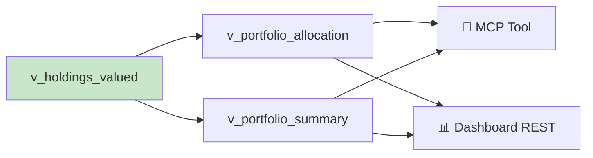

> Hesap **tek yerde**: view. Ajan da dashboard da aynı view'ı okur.
> İki yerde hesaplarsanız iki farklı toplam görürsünüz.

## 9.3 Para Birimi

USD/EUR varlıklar `v_fx_rates` üzerinden TRY'ye çevrilir; toplamlar `market_value_try` üzerinden alınır. Şema, `db/v5_schema_and_data.sql` dosyasındadır ve PostgreSQL 16 + pgvector üzerinde uçtan uca doğrulanmıştır.

---

# 10 · KONTRATLAR

> Bu bölüm v2.3 ile v3'ün çeliştiği yerdir. Aşağıdaki tek sözleşme geçerlidir; **⚖️ işaretli maddeler ekip onayı bekliyor.**

## 10.1 SSE Olayları ⚖️

```jsonc
{"type":"meta",        "request_id":"…", "conversation_id":1}
{"type":"status",      "stage":"security|routing|agents|risk|synth", "message":"…"}
{"type":"sources",     "items":[{"doc_id","baslik","sirket","tarih","tip","score"}]}
{"type":"token",       "content":"Portföyünüzün "}
{"type":"agent_error", "agent":"market_research", "error_type":"timeout"}
{"type":"error",       "code":"LLM_UNAVAILABLE", "message":"…"}
{"type":"done",        "message_id":42, "latency_ms":8420}
```

**Sıra garantisi:** `meta` ilk · `sources` ilk `token`'dan önce · `done` son.

| Olay | Ne zaman | Frontend davranışı |
|---|---|---|
| `meta` | Akış başlarken | `request_id` saklanır (hata bildiriminde kullanılır) |
| `status` | Node tamamlandığında | Durum mesajı gösterilir |
| `sources` | Kaynaklar hazır olduğunda (security_gate sonrası) | Kaynak kartları yerleştirilir |
| `token` | Synthesizer token üretirken | Mesaja parça parça eklenir |
| `agent_error` | Tek ajan timeout/hata verdiğinde | Kısmi başarısızlık uyarısı; sohbet fail edilmez |
| `error` | Graph çalışamazsa | Genel hata mesajı |
| `done` | Akış bittiğinde | Stream kapatılır, mesaj kalıcı hâle getirilir |

**v2.3'ten gelen değişiklikler:**
- `final` olayı **kaldırıldı**. `reject_response` / `safe_response` metinleri de `token` olarak gönderilir; frontend'in tek render yolu olur. (Mevcut kod da böyle çalışıyor.)
- `data: [DONE]` sentinel'i yerine **JSON `done` olayı** kullanılır: `message_id` ve `latency_ms` taşıyabildiği için mesajı kalıcı hâle getirmek ve süre ölçmek mümkün olur. FastAPI katmanı isterse geriye dönük uyum için ardından `data: [DONE]` da yazabilir.
- `error` olayı hem makine-okunur `code` hem kullanıcıya gösterilecek `message` taşır. **İstisna metni (`str(exc)`) istemciye gönderilmez** — yalnızca loga yazılır.

## 10.2 REST Uçları ⚖️

**Karar: granüler uçlar + `/me` auth deseni.** `user_id` hiçbir zaman URL veya body ile taşınmaz; token'dan çözülür.

| Metot | Yol | Besler | Kaynak |
|---|---|---|---|
| POST | `/api/auth/login` | Login | ikisi de |
| GET | `/api/auth/me` | AppShell | ikisi de |
| GET | `/api/dashboard/summary` | Dashboard ilk yükleme (birleşik özet) | v2.3 |
| GET | `/api/portfolio/summary` | SummaryCards | v3 |
| GET | `/api/portfolio/holdings` | HoldingsTable | v3 |
| GET | `/api/portfolio/allocation` | AllocationPie | v3 |
| GET | `/api/portfolio/transactions?limit=` | İşlem geçmişi | v2.3 |
| GET | `/api/market/assets` | Piyasa sekmesi | v3 |
| GET | `/api/market/history?symbol=&days=` | PriceChart | ikisi de |
| POST | `/api/market/search` | RAG destekli piyasa araması | v2.3 |
| GET | `/api/risk/profile` | RiskPanel | v2.3 (`/risk/me` → `/risk/profile`) |
| GET | `/api/conversations` | ConversationList | v3 |
| GET | `/api/conversations/{id}/messages` | MessageList | v3 |
| POST | `/api/chat/stream` | Chat (SSE) | ikisi de |
| GET | `/health` | — | ikisi de |

**Neden granüler + tek birleşik dashboard ucu:** Bileşen başına uç, TanStack Query'nin bileşen bazlı önbelleğe alma ve yeniden çekme davranışıyla uyumlu; ekran başına tek uç ise dashboard'un ilk yüklemesini 4 istekten 1'e indiriyor. İkisi birden tutuldu: dashboard **ilk yükleme** için `/api/dashboard/summary`, sekmeler ve tazeleme için granüler uçlar.

**Sürüm ön eki yok** (`/api/v1` değil `/api`): tek sürüm var, dış tüketici yok. İleride gerekirse router prefix'lerine tek satırla eklenir.

**Raporlar (`POST /api/reports`) Sprint 4'e ertelendi** — FR-RISK-04 kapsamında, önce chat ve dashboard akışı tamamlanmalı.

## 10.3 JSON Alan Adlandırma ⚖️

**Karar: her yerde `snake_case`.**

v2.3 REST yanıtları için camelCase öneriyordu. Gerekçeyle reddedildi:

- DB (`total_value_try`), Pydantic modelleri, `Source`/`AgentError` ve SSE olayları zaten snake_case. camelCase yalnızca REST'e uygulanırsa frontend **iki ayrı sözleşme** taşımak zorunda kalır — v2.3'ün kendisi de bu tutarsızlığı kabul ediyor.
- RAG metadata alanları Türkçe ve snake_case (`baslik`, `sirket`, `tarih`, `tip`); bunları camelCase'e çevirmek anlamsız (`baslik` → `baslik`).
- Frontend henüz hiçbir alan adına bağlanmadı (mock adaptörde yalnızca `getHealth` var) — yani şimdi tek sözleşmede karar kılmanın maliyeti sıfır.

TypeScript tarafında snake_case alan adları tip tanımlarında sorun çıkarmaz.

## 10.4 Router Kararı

```python
class RouterDecision(BaseModel):
    intent: Literal["portfoy","piyasa","risk","karma","sohbet","belirsiz"]
    agents: list[Literal["portfolio","market_research","risk_strategy"]]
    needs_clarification: bool = False
    clarifying_question: str | None = None
    reasoning: str
```

Router **kural tabanlıdır** (LLM'siz) — ücretsiz API kotasını korumak için bilinçli tercih. Hiçbir anahtar kelime eşleşmezse güvenli varsayılan **tüm ajanları çalıştırmaktır**; eksik yanıt vermektense biraz fazla çalışmak yeğlenir.

| Senaryo | LLM çağrısı |
|---|---|
| Basit sohbet | 1–2 |
| Tam akış | 5–7 |

---

# 11 · GÜVENLİK

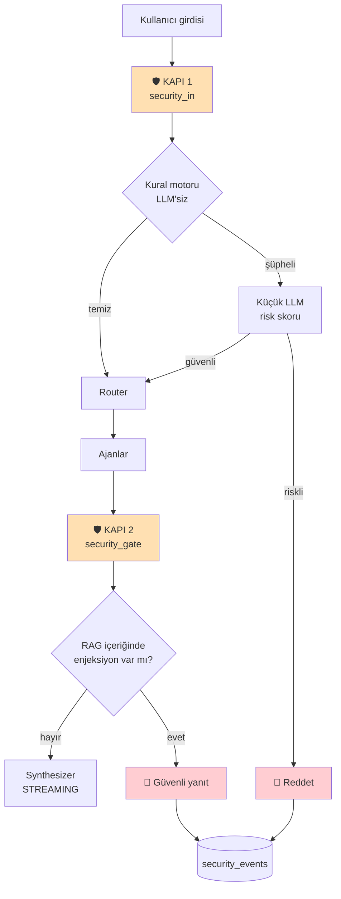

| Tehdit | Kontrol |
|---|---|
| Prompt injection (kullanıcı) | Kapı 1 — kural motoru + LLM |
| Dolaylı injection (RAG dokümanı) | Kapı 2 — chunk metni taranır |
| Başka kullanıcının verisi | MCP contextvar doğrulaması |
| Yetkisiz konuşma erişimi | `conversation_id` sahiplik kontrolü |
| PII sızıntısı | Log ve `tool_calls.args` maskeleme |
| Yatırım tavsiyesi algısı | Synthesizer sistem promptu |

**Neden Kapı 2 sentezden önce:** token gönderildikten sonra geri alınamaz. Denetim, synthesizer LLM'i çalışmadan **önce**, ajanlardan gelen ham veri üzerinde yapılır. Uyum kuralları (yatırım tavsiyesi ibaresi, PII maskeleme, kaynak gösterimi) synthesizer sistem promptunda taşınır.

**Maliyet optimizasyonu (iki kademeli filtre):** Önce kural motoru (`apply_rules` — regex, LLM'siz, ~1ms). Yalnızca kural motoru şüphe işareti verirse LLM tabanlı `classify_risk` devreye girer. İstek başına LLM çağrısını 6'dan 4'e indirir.

> ⚠️ **Türkçe zorunluluğu:** Sistem dili Türkçe olduğu için kural desenleri **hem diakritikli hem eksiz/ekli** yazımları yakalamalıdır. Desen eşleşmesi öncesi metin normalize edilmeli (`Önceki` → `onceki`) ve ek çekimine tolerans tanınmalıdır (`kurallarını yoksay`). Aksi hâlde Türkçe yazılmış injection sessizce geçer. Test seti **mutlaka Türkçe cümleler içermelidir.**

> **Fail-closed:** LLM sınıflandırıcı bağlı değilken veya çağrı başarısız olduğunda risk skoru `1.0` kabul edilir. Bu, kural motorunun yanlış pozitiflerinin doğrudan blok anlamına geldiği anlamına gelir — desenler bu bilinçle dar tutulmalıdır.

---

# 12 · KLASÖR YAPISI VE SORUMLULUKLAR

```
backend/app/
├── main.py           FastAPI giriş noktası, router registration, lifespan
├── config.py         Settings, ajan bazlı model konfigürasyonu
├── api/routes/       health · auth · dashboard · portfolio · market · risk · conversations · chat
├── schema/           AgentState, Source, AgentError, ToolResult, RouterDecision
├── schemas/          REST request/response Pydantic modelleri
├── auth/             JWT, get_current_user bağımlılığı
├── services/         ekran verisi domain servisleri
├── repositories/     veri erişim katmanı (DB gelene kadar in-memory)
├── mcp/              client.py (ortak instance) · server.py (tool grupları)
├── agents/           base · market_research · portfolio · risk_strategy · security_agent
├── engine/           orchestrator.py (graph, router, synthesizer) · factory.py (wiring)
├── rag/              ingestion.py · retrieval.py · embedding.py
├── market/           provider.py · scheduler.py
├── db/               oturum yönetimi
└── core/             logging (request-id) · errors (global hata formatı) · llm.py
db/                   v5_schema_and_data.sql — şema, view'lar, hibrit arama, dummy data
frontend/src/         bkz. bölüm 4.7
docs/                 bu doküman · backend-kararlar.md · api-sozlesmesi.md
tests/
```

> ⚖️ **`schema/` ile `schemas/` yan yana duruyor** — biri orkestrasyon modelleri, diğeri REST modelleri. Tek harf farkı kalıcı karışıklık üretir; `schema/` → `orchestration/` olarak yeniden adlandırılması önerilir.

| Modül | Sorumlu | Açıklama |
|---|---|---|
| `schema/` | Backend Lead | Ortak veri modelleri; **reducer kuralları burada, değiştirmeden önce danışın** |
| `config.py` | Backend Lead | Ortam değişkenleri, model seçimi |
| `api/routes/` | Backend Ekibi | REST ve SSE endpointleri |
| `services/` | Backend Ekibi | Ekran verisi domain servisleri |
| `mcp/` | Backend Lead | Ortak client + sunucu, tool grupları |
| `agents/market_research.py` | *(isim yazılacak)* | RAG entegrasyonu, kaynak metadata aktarımı |
| `agents/portfolio.py` | *(isim yazılacak)* | Portföy tool çağrıları, dağılım |
| `agents/risk_strategy.py` | *(isim yazılacak)* | Risk skorlama, rebalance |
| `agents/security_agent.py` | *(isim yazılacak)* | Kural motoru + LLM sınıflandırıcı |
| `market/` | Backend Lead | Fiyat sağlayıcı, periyodik güncelleme, kota koruması |
| `engine/` | Backend Lead | Graph, routing, sentez, streaming, wiring |
| `rag/`, `db/v5_*.sql` | RAG grubu | Ingestion, retrieval, şema |
| `frontend/` | Frontend Ekibi | Sayfalar, SSE tüketimi, grafikler |
| `tests/` | Tüm ekip | Her modül kendi testinden sorumlu |

---

# 13 · GEREKSİNİM İZLENEBİLİRLİĞİ

| Gereksinim | Mimarideki karşılığı |
|---|---|
| FR-CHAT-02 (streaming) | SSE endpoint + `astream(stream_mode=["updates","messages"])`; synthesizer token akıtır |
| FR-CHAT-03 (çok turlu bağlam) | `AgentState.messages` + `thread_id` + LangGraph checkpointer |
| FR-CHAT-04 (yönlendirme) | `router` node + `route_intent` |
| FR-RAG-04 (izlenebilirlik) | `Source` modeli, `rag_search` yapılandırılmış dönüş, `sources` reducer'ı, SSE `sources` olayı |
| FR-RISK-04 (detaylı rapor) | `POST /api/reports` — Sprint 4 |
| FR-RISK-05 (uyarı ibaresi) | Synthesizer sistem promptu |
| FR-AGENT-02 (paralel yürütme) | Bağımsız ajanlar fan-out kenarlarıyla paralel; bağımlı ajan sıralı (5.2) |
| FR-AGENT-04 / NFR-04 (yalnızca MCP) | Ajanlarda DB erişimi yok; tek DB dokunma noktası `mcp/server.py` |
| FR-DASH-03 (gerçek zamanlı güncelleme) | Piyasa Verisi Katmanı: periyodik fiyat görevi + `market_*` tool grubu (8) |
| NFR-01 (ilk token ~3sn) | Denetim sentezden önce; synthesizer doğrudan akıtır; risk ajanına küçük model |
| NFR-05 (izlenebilirlik/log) | `core/logging.py` request-id, `ToolResult.latency_ms`, `tool_calls` tablosu |

---

# 14 · DOKÜMAN ↔ KOD FARKLARI (13 Ağustos 2026)

Bugünkü kodun bu dokümandan saptığı yerler — her satır bir iş kalemidir.

| # | Konu | Bugünkü durum | Hedef |
|---|---|---|---|
| 1 | Orchestrator HTTP'ye bağlı değil | `/api/chat/stream` yok | Bölüm 10.2 |
| 2 | SSE `meta` / `done` / `agent_error` olayları | üretilmiyor | Bölüm 10.1 |
| 3 | `status` olayı `stage` alanı | `node` alanı taşıyor | Bölüm 10.1 |
| 4 | Reducer'lı alanlar tur başında sıfırlanmıyor | `sources`/`agent_errors` birikiyor | Bölüm 5.3 uyarısı |
| 5 | Güvenlik desenleri Türkçe injection'ı kaçırıyor | ASCII desenler, normalize yok | Bölüm 11 uyarısı |
| 6 | `AgentState.user_id` / `thread_id` | `str` | `int` (5.3) |
| 7 | `AgentState` eksik alanlar | `request_id`, `portfolio_id`, `intent` yok | Bölüm 5.3 |
| 8 | Kimlik doğrulama | yok | JWT + `get_current_user` |
| 9 | PortfolioAgent / RiskStrategyAgent | yazılmadı | Bölüm 5.5 |
| 10 | MCP sunucusu | mock tool'lar (`mcp/mock.py`) | Bölüm 6.2 |
| 11 | DB bağlantısı | `db/session.py` yorumda, repository in-memory | Bölüm 9 |
| 12 | REST uçları | stub'lar farklı isimlerde (`/api/market/news`) | Bölüm 10.2 |
| 13 | `schema/` vs `schemas/` | yan yana | Bölüm 12 |

---

# 15 · GENİŞLETME NOKTALARI

## 15.1 Yeni Ajan Ekleme

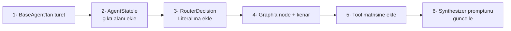

**Kural:** Başka ajanın çıktısına ihtiyaç duyuyorsa sıralı, duymuyorsa paralel.

## 15.2 Yeni MCP Tool Ekleme

```mermaid
flowchart LR
    A["1· mcp/server.py'a<br/>@mcp.tool"] --> B["2· Ortak zarfı döndür"]
    B --> C["3· user_id'yi<br/>contextvar'dan al"]
    C --> D["4· Ajan tool<br/>listesine ekle"]
```

## 15.3 Yeni Sayfa / Grafik Ekleme

```mermaid
flowchart LR
    A["1· DB view'ı"] --> B["2· REST ucu"]
    B --> C["3· Query hook"]
    C --> D["4· Bileşen"]
```

## 15.4 Ölçeklenme Yolu (proje sonrası)

```mermaid
flowchart LR
    A["Modular Monolith<br/>tek container"] -.->|"gerekirse"| B["Ajan servisleri ayrılır"]
    A -.->|"gerekirse"| C["Vektör DB ayrılır"]
    A -.->|"gerekirse"| D["Redis cache + kuyruk"]
    style A fill:#c8e6c9
```

---

# 16 · AÇIK KARARLAR

| # | Konu | Durum |
|---|---|---|
| 1 | **Embedding modeli** | RAG grubu kararlaştıracak — Türkçe retrieval belirleyici. Seçilmeden gerçek embedding üretilmez; `vector(1024)` iki yerde değişir |
| 2 | ⚖️ SSE olay kümesi (10.1) | Bu dokümandaki hâli önerilmiştir; frontend ile onaylanacak |
| 3 | ⚖️ REST uç listesi (10.2) | Aynı |
| 4 | ⚖️ JSON alan adlandırma (10.3) | snake_case önerildi; frontend ile onaylanacak |
| 5 | ⚖️ `schema/` → `orchestration/` yeniden adlandırma | Önerildi |
| 6 | LLM API anahtarı ve bütçe | Temin edilmedi |
| 7 | LangGraph checkpointer | Demo için bellek içi yeterli; kalıcılık gerekirse PostgreSQL |
| 8 | Gerçek piyasa API sağlayıcısı | `hybrid` kullanılacaksa PO onayı + lisans kontrolü |
| 9 | Güvenlik ajanı sorumlusu | Belirlenmedi |
| 10 | Sorumluluk tablosundaki isimler | Yazılacak (bölüm 12) |
| 11 | Gözlemlenebilirlik aracı | Sprint 3'te değerlendirilecek |
| 12 | Basit sorularda fan-out atlama | Sprint 3 optimizasyonu |
| 13 | PO görüşmesi | Yapılmadı — gereksinim dokümanındaki 6 varsayım onaysız |

---

**Doküman durumu:** v4 — v2.3 ve v3 birleştirildi, dört kontrat çelişkisi tek sözleşmede toplandı, kod ile doküman arasındaki farklar bölüm 14'te listelendi.
