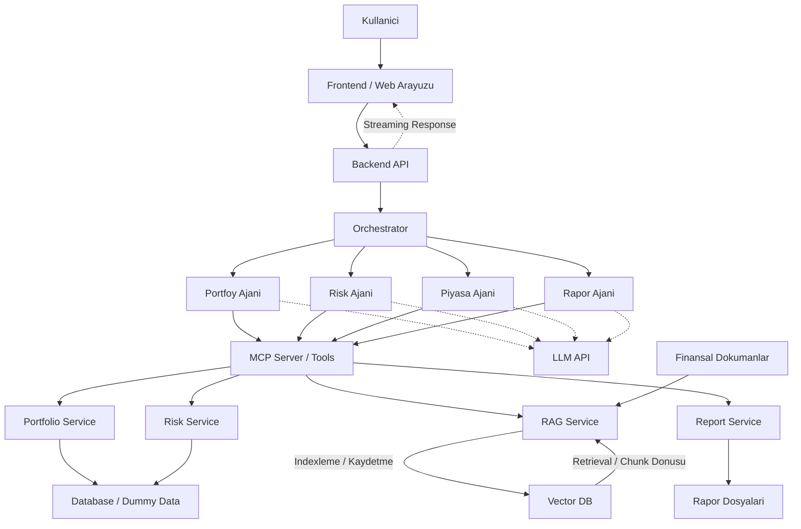
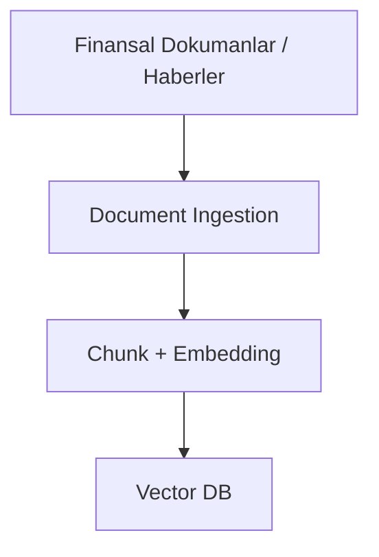
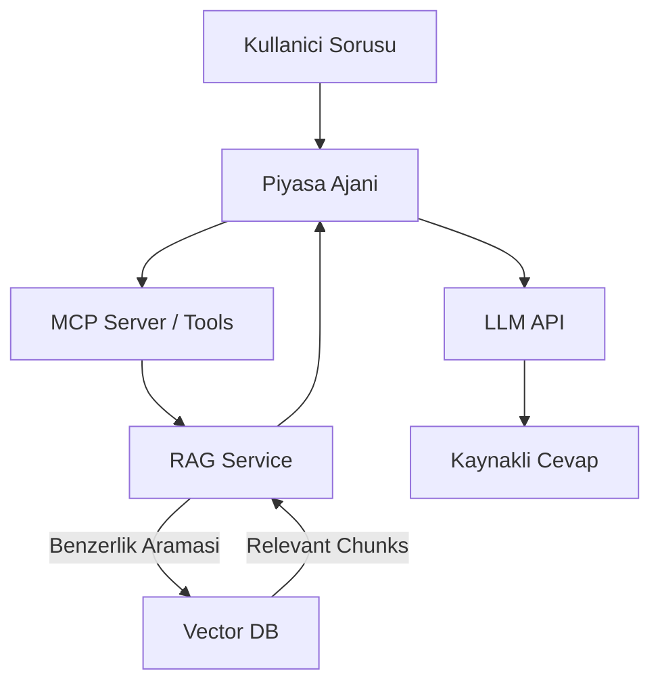

# Akilli Kisisel Finans Danismani - Sistem Mimarisi

## Genel Sistem Mimarisi

Bu mimaride ajanlar birbirlerini dogrudan cagirmamaktadir. Tum ajan cagirilari Orchestrator uzerinden yonetilir. MCP katmani ajanlarin servis ve veri kaynaklarina standart tool cagrilariyla erismesini saglar. LLM API ise yorumlama, ozetleme ve metin uretimi icin kullanilir.

## Mimari Kararlar

- Ajanlar birbirleriyle dogrudan haberlesmez.
- Orchestrator, hangi ajanin ne zaman calisacagina karar verir.
- Portfolio Agent portfoy hesaplamalarindan sorumludur.
- Risk Agent risk skoru ve strateji onerilerinden sorumludur.
- Piyasa Agent finansal haber ve rapor bilgilerini RAG uzerinden kullanir.
- Rapor Agent portfoy, risk ve piyasa ciktilarindan anlamli rapor icerigi uretir.
- MCP, veri ve tool erisimi icin kullanilir.
- LLM API, yorumlama, ozetleme ve metin uretimi icin kullanilir.
- Streaming Response, backend'den frontend'e cevabin parca parca aktarilmasini ifade eder.

## RAG Service Notu

Ana mimari diyagraminda sadelik icin dokuman isleme adimlari detaylandirilmamistir. RAG Service, finansal dokumanlarin sisteme alinmasi, parcalara bolunmesi, embedding olusturulmasi, Vector DB'ye kaydedilmesi ve kullanici sorularinda ilgili parcalarin geri getirilmesi sureclerini yonetir.

### Ingestion Sureci

### Retrieval Sureci

## Kisa Aciklama

Kullanici istegi frontend uzerinden Backend API'ye gelir. Backend API istegi Orchestrator'a iletir. Orchestrator istegin turune gore ilgili ajanlari cagirir. Ajanlar veri veya servis erisimi gerektiginde MCP tool'larini kullanir. Yorumlama, ozetleme veya rapor metni uretimi gereken durumlarda LLM API'den yararlanilir. Sonuc Backend API uzerinden frontend'e doner.
